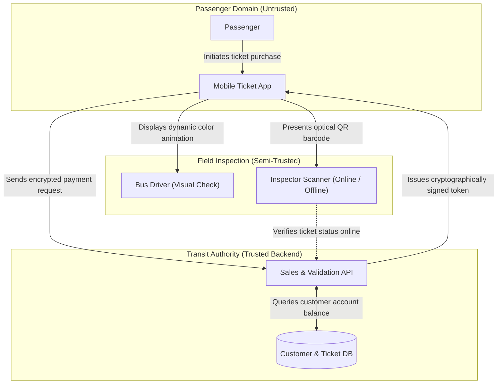
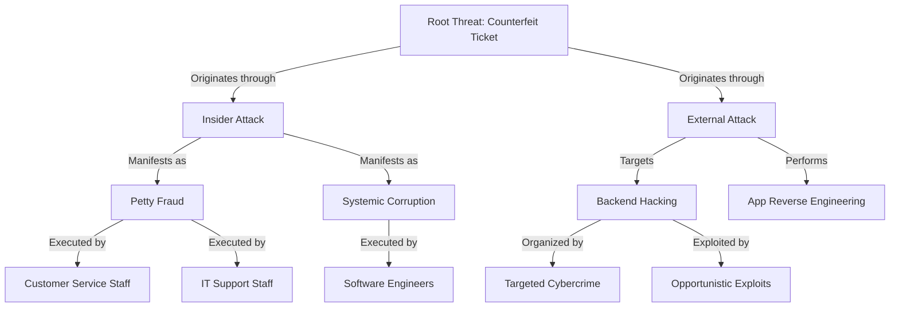

# Graph Skill (`/graph`)

Use this skill to convert architectural schematics, threat trees, data flow diagrams, and protocol workflows (`<!-- MODULE:graph ... -->`) into clean Mermaid.js diagrams.

---

## Core Guidelines & Format Reference

### 1. Triggered Visual Conditions
Generate a graph whenever the material involves:
- Multi-component system architecture and trust boundaries.
- Sequential protocol handshakes and message flows.
- Hierarchical threat decompositions and taxonomies (e.g., threat trees).
- Data Flow Diagrams (DFDs) crossing process/storage boundaries.

### 2. Obsidian-Safe Mermaid Syntax Rules
- **Node IDs**: Strictly alphanumeric and underscores only (`node_A`, `auth_server`). Never include spaces or dashes in node IDs.
- **Labels**: Always quote labels containing special characters, brackets, or parentheses: `client["Passenger App (Android / iOS)"]`.
- **No Raw HTML**: Do not use `<br>` or `<b>` inside node strings. Use standard text or clean punctuation.
- **Trust Boundaries**: Use Mermaid `subgraph` blocks to demarcate security domains, administrative jurisdictions, and trust boundaries.

### 3. Verb-Object Phrasing on Flowchart Edges

> [!IMPORTANT]
> **Verb-Object Phrasing for Edge Labels**:
> For all Mermaid flowcharts and state diagrams, edge labels describing transitions, message passing, or step movements MUST strictly use **verb-object phrases** detailing how entities/data move along the flow:
> - **Good**: `-->|"Transmits signed token"|`, `-->|"Validates public key"|`, `-->|"Issues challenge nonce"|`, `-->|"Logs inspection event"|`
> - **Bad**: `-->|"Token"|`, `-->|"Public key"|`, `-->|"Yes"|`, `-->|"Next"|`

### 4. Narrative Walkthrough
Every diagram must be followed immediately by a concise narrative explaining:
- The operational roles of the depicted entities.
- How data and control signals transition across boundaries.
- Critical single points of failure or adversarial exposure points.

---

## Reference Templates

### 1. Architectural Diagram with Trust Boundaries
````markdown

````

### 2. Hierarchical Threat Tree Taxonomy
````markdown

````
