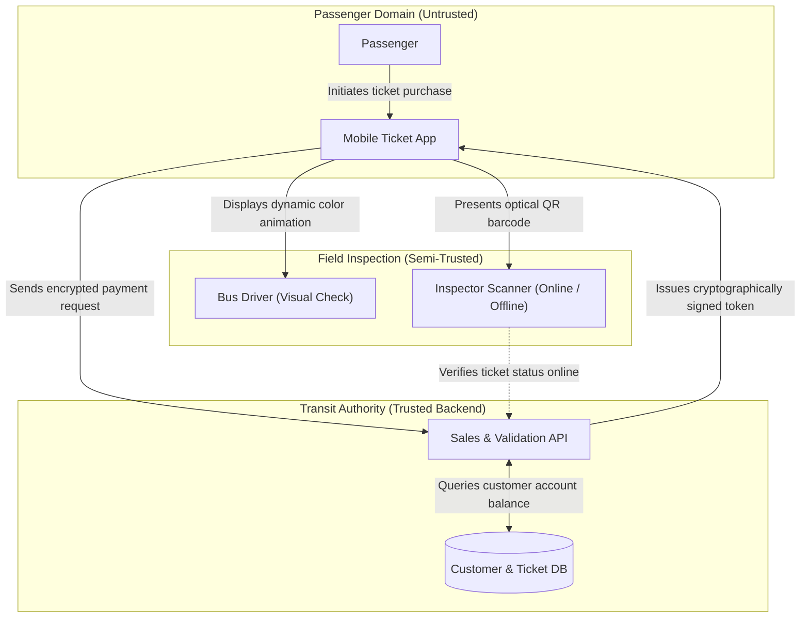

---
# Module-specific overrides
diagram_engine: "mermaid"
orientation: "TD"
foldable_callouts: true
---

# Graph & Diagram Module Specification

Use this skill to convert architectural schematics, threat trees, data flow diagrams, and protocol workflows (`<!-- MODULE:graph ... -->`) into clean Mermaid.js diagrams.

---

## Core Guidelines & Format Reference

### 1. Triggered Visual Conditions
Generate a graph whenever the material involves:
- Multi-component system architecture and trust boundaries.
- Sequential protocol handshakes and message flows.
- Hierarchical threat decompositions and taxonomies (e.g., threat trees).
- Data Flow Diagrams (DFDs) crossing process/storage boundaries.

### 2. Obsidian-Safe Mermaid Syntax Rules
- **Node IDs**: Strictly alphanumeric and underscores only (`node_A`, `auth_server`). Never include spaces or dashes in node IDs.
- **Labels**: Always quote labels containing special characters, brackets, or parentheses: `client["Passenger App (Android / iOS)"]`.
- **No Raw HTML**: Do not use ` ` or `<b>` inside node strings. Use standard text or clean punctuation.
- **Trust Boundaries**: Use Mermaid `subgraph` blocks to demarcate security domains, administrative jurisdictions, and trust boundaries.

### 3. Verb-Object Phrasing on Flowchart Edges
For all Mermaid flowcharts and state diagrams, edge labels describing transitions, message passing, or step movements MUST strictly use **verb-object phrases**:
- **Good**: `-->|"Transmits signed token"|`, `-->|"Validates public key"|`, `-->|"Issues challenge nonce"|`
- **Bad**: `-->|"Token"|`, `-->|"Public key"|`, `-->|"Yes"|`

### 4. Narrative Walkthrough
Accompany diagrams with a concise narrative explaining:
- The operational roles of the depicted entities.
- How data and control signals transition across boundaries.
- Critical single points of failure or adversarial exposure points.

---

## Depth Specification

- **`depth="1"` (Mentioned in Passing)**:
  - 3–4 node simple linear or hierarchical chart with plain text labels.
  - Omit narrative walkthrough callout.
- **`depth="2"` (Discussed, but not fleshed out)**:
  - Standard flowchart or state machine with verb-object edge labels.
  - Accompanied by a concise folded walkthrough callout (`> [!info]- Architectural Walkthrough`).
- **`depth="3"` (Explained in-detail in source - Default)**:
  - Comprehensive multi-subgraph architectural schematic or threat tree with explicit trust boundaries and verb-object transitions.
  - Includes an in-depth folded walkthrough callout analyzing failure points, threat exposures, and mitigation boundaries.

---

## Expected Output Format

> [!IMPORTANT]
> Worker modules output **ONLY** the body content below. Do not generate section headings (`##`, `###`) or introductory quote callouts (`> [!quote]`).

> [!info]- Architectural Walkthrough
> - **Client Domain**: Untrusted execution environment where reverse engineering and replay attacks originate.
> - **Transport Domain**: Protected core validating transactions and maintaining authoritative ledger state.
> - **Inspection Domain**: Distributed validation points balancing passenger throughput against cryptographic verification guarantees.
