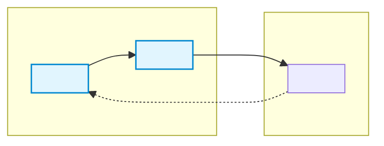

# Graph Module Specification

Use this module to visualize multi-component architectures, distributed service topologies, trust boundaries, message flows, and hierarchical dependencies.

---

## 1. Visual Skeleton

```markdown
<!-- MODULE:graph section="<section_number>" topic="<topic_description>" depth="<1|2|3>" ... -->

```mermaid
flowchart LR
    subgraph Boundary_A["<Trust / Administrative Boundary A>"]
        Node_A["<Component A: Role>"]
        Node_B["<Component B: Role>"]
    end

    subgraph Boundary_B["<Trust / Administrative Boundary B>"]
        Node_C["<Component C: Role>"]
    end

    Node_A -->|"<Action / Data Unit 1>"| Node_B
    Node_B -->|"<Protocol / Encrypted Payload 2>"| Node_C
    Node_C -.->|"<Status / Response 3>"| Node_A

    classDef primary fill:#e1f5fe,stroke:#0288d1,stroke-width:1.5px;
    class Node_A,Node_B primary;
```

> [!info]- Component & Interaction Dictionary
> - **<Component A>**: <Role, responsibilities, and trust assumption.>
> - **<Component B>**: <Role, responsibilities, and trust assumption.>
> - **<Component C>**: <Role, responsibilities, and trust assumption.>
> - **Critical Interaction**: <Key security or operational invariant across the boundary.>
```

## 2. Depth Matrix

| Depth | Scale / Scope | Components Included | Tone & Rigor | Fold Stance |
| :---: | :--- | :--- | :--- | :--- |
| **`1`** | 2–3 nodes | High-level topology diagram only; omit dictionary callout | High-level, structural | Open Mermaid block |
| **`2`** | 4–6 nodes + boundaries | Diagram with subgraphs & verb-object edges + folded dictionary | Standard architectural | Diagram open, dictionary folded (`-`) |
| **`3`** | Full topology + edges | Full multi-boundary graph + verb-object edges + exhaustive interaction dictionary | Comprehensive, rigorous | Diagram open, dictionary folded (`-`) |

## 3. Strict Negative Invariants

- **Tag + Body Content Only**: Output ONLY the module tag and the Mermaid block/callout directly below it.
- **No Headings or Quote Callouts**: NEVER generate markdown headings (`##`, `###`) or section intro quote callouts (`> [!quote]`).
- **No Bare Edges**: Every directional edge must have an explicit verb-object label (`-->|action/payload|`).
- **No Overloaded Flat Graphs**: Use subgraphs to denote distinct trust domains, machines, or tiers.
