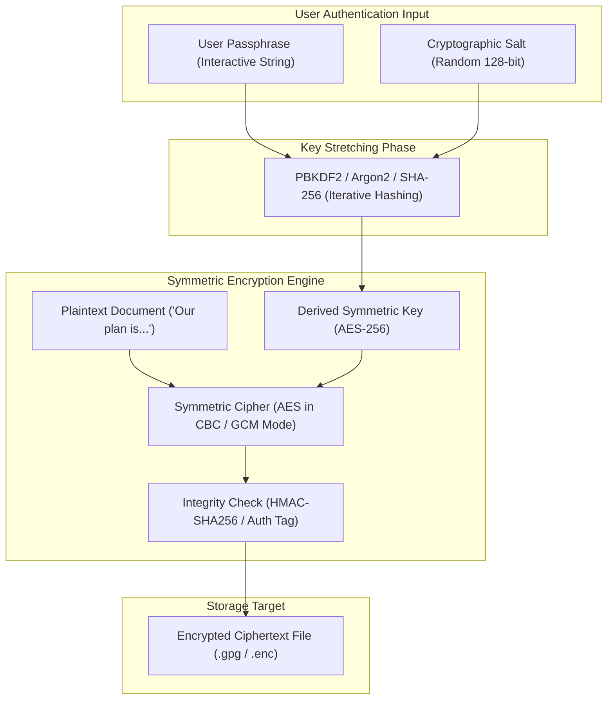
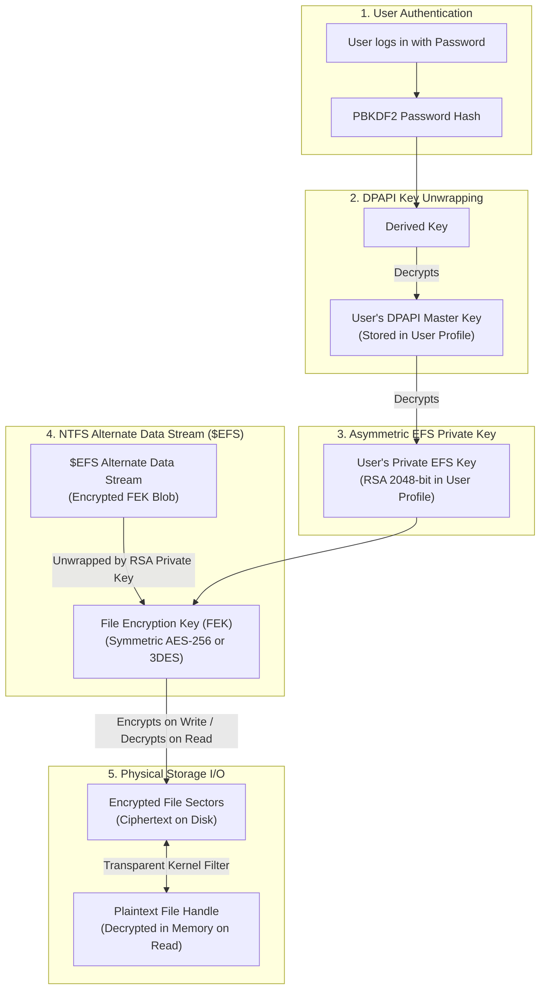
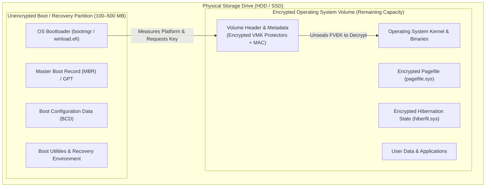
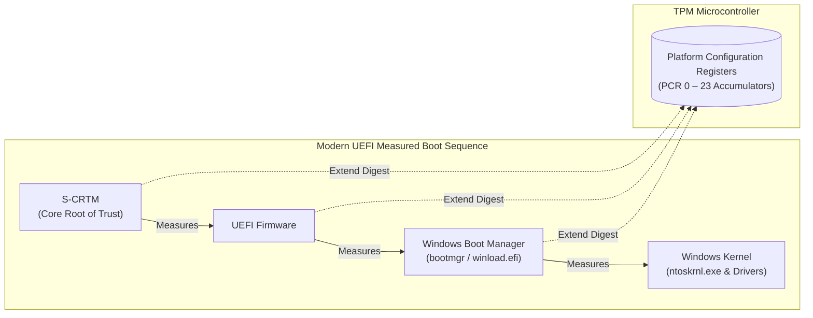
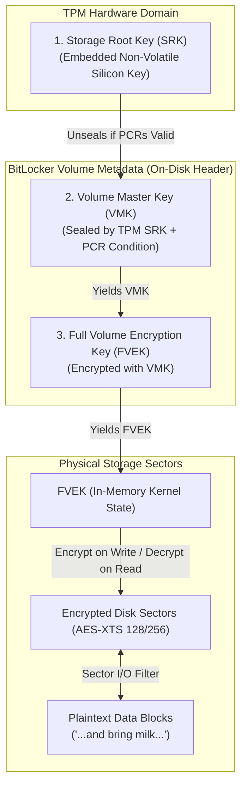
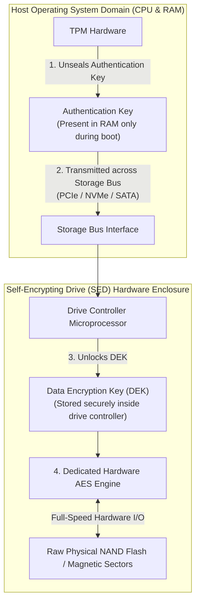
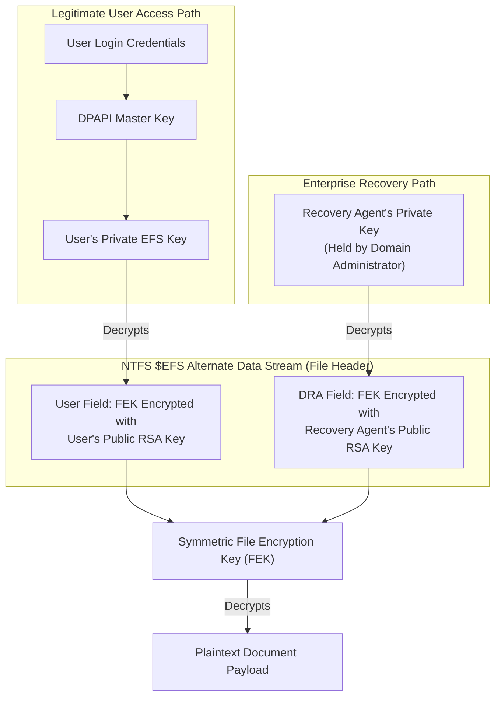

> Encrypting stored data mitigates confidential data exposure resulting from lost or stolen mobile computers, compromised servers, and decommissioned drives. While conceptually straightforward, practical storage security creates severe tensions between cryptographic protection, usability, and data recovery, requiring sophisticated multi-tier key hierarchies, hardware roots of trust (TPM), and carefully architected recovery agents.

# Overview

```
Encrypting Stored Data
 ├── Scenarios & Foundations of Data Encryption
 │     ├── Threat Scenarios & Storage Trade-offs
 │     │     ├── Physical Exposure Vectors
 │     │     └── Usability vs Reliability Tension
 │     ├── File Deletion Mechanics & Remanence
 │     │     ├── Space Deallocation vs Erasure
 │     │     └── Unpredictable File System Behaviors
 │     └── Disk Wiping & SSD Overprovisioning
 │           ├── Free Space Overwriting Mechanics
 │           ├── SSD Wear Leveling & Spare Area
 │           └── Physical Media Destruction*
 ├── File-Level Encryption
 │     ├── Passphrase-Based Symmetric File Encryption
 │     │     ├── Password-Based Key Derivation
 │     │     └── Cipher Modes & Integrity Verification
 │     └── Operational Limitations & Data Leakage
 │           ├── Plaintext Remanence & Backup Copies
 │           └── Background Services & Cloud Incompatibility
 ├── Windows Encrypting File System (EFS)
 │     ├── Architecture & NTFS File Attributes
 │     │     ├── Transparent Encryption Attribute
 │     │     └── Directory Inheritance Model
 │     ├── DPAPI & Multi-Tier Key Hierarchy
 │     │     ├── DPAPI Master Key Derivation
 │     │     ├── User Private EFS Key Protection
 │     │     └── File Encryption Key & $EFS Stream
 │     ├── Security Limitations & Threat Vectors
 │     │     ├── Partial Protection & Metadata Exposure
 │     │     └── Physical Access & Malicious DRA Injection
 │     └── Usability Pitfalls & Key Traps
 │           ├── Password Reset Data Loss Trap
 │           └── Removable Media & FAT PFILE Conversion
 ├── Full Disk Encryption & Windows BitLocker
 │     ├── Whole-Volume Encryption & Partition Architecture
 │     │     ├── Pre-Boot Environment Separation
 │     │     └── Encrypted Windows vs Boot Partitions
 │     ├── Trusted Platform Module & Measured Boot
 │     │     ├── Hardware Root of Trust & Tamper Resistance
 │     │     ├── Integrity Accumulation & PCR Extension
 │     │     └── BIOS vs UEFI Measured Boot Flow
 │     ├── Cryptographic Sealing & Key Hierarchy
 │     │     ├── PCR-Conditioned Unsealing
 │     │     └── SRK, VMK, and FVEK Separation
 │     ├── Operational Modes & Unsupervised Boot
 │     │     ├── Transparent TPM-Only Boot
 │     │     ├── Supervised TPM with PIN Protection
 │     │     └── Enterprise Network Unlock*
 │     ├── Physical Memory & Hardware Attacks
 │     │     ├── Direct Memory Access (DMA) Exploitation
 │     │     ├── TPM Interconnect Bus Sniffing
 │     │     └── Cold Boot DRAM Remanence Attacks
 │     └── Hardware Offloading & Maintenance Exposures
 │           ├── Self-Encrypting Drives & TCG Opal
 │           ├── Bus Exposure vs Memory Protection Trade-offs
 │           └── OS Update BitLocker Suspension Flaws
 └── Cryptographic Data Recovery Architectures
       ├── The Data Recovery Imperative
       │     ├── Irreversible Key Loss Hazards
       │     └── Platform Configuration Drift Triggers
       ├── EFS Recovery Mechanics
       │     ├── Domain Data Recovery Agents (DRA)
       │     ├── Dual-Key FEK Asymmetric Wrapping
       │     └── Standalone Key Export & Password Reset Disks
       └── BitLocker Recovery Mechanisms
             ├── 48-Digit Numeric Recovery Passwords
             └── Active Directory & Cloud Key Escrow
```

---

## Table of Contents
- [1. Scenarios & Foundations of Data Encryption](#1-scenarios--foundations-of-data-encryption)
  - [1.1 Threat Scenarios & Storage Trade-offs](#11-threat-scenarios--storage-trade-offs)
  - [1.2 File Deletion Mechanics & Remanence](#12-file-deletion-mechanics--remanence)
  - [1.3 Disk Wiping & SSD Overprovisioning](#13-disk-wiping--ssd-overprovisioning)
- [2. File-Level Encryption](#2-file-level-encryption)
  - [2.1 Passphrase-Based Symmetric File Encryption](#21-passphrase-based-symmetric-file-encryption)
  - [2.2 Operational Limitations & Data Leakage](#22-operational-limitations--data-leakage)
- [3. Windows Encrypting File System (EFS)](#3-windows-encrypting-file-system-efs)
  - [3.1 Architecture & NTFS File Attributes](#31-architecture--ntfs-file-attributes)
  - [3.2 DPAPI & Multi-Tier Key Hierarchy](#32-dpapi--multi-tier-key-hierarchy)
  - [3.3 Security Limitations & Threat Vectors](#33-security-limitations--threat-vectors)
  - [3.4 Usability Pitfalls & Key Traps](#34-usability-pitfalls--key-traps)
- [4. Full Disk Encryption & Windows BitLocker](#4-full-disk-encryption--windows-bitlocker)
  - [4.1 Whole-Volume Encryption & Partition Architecture](#41-whole-volume-encryption--partition-architecture)
  - [4.2 Trusted Platform Module & Measured Boot](#42-trusted-platform-module--measured-boot)
  - [4.3 Cryptographic Sealing & Key Hierarchy](#43-cryptographic-sealing--key-hierarchy)
  - [4.4 Operational Modes & Unsupervised Boot](#44-operational-modes--unsupervised-boot)
  - [4.5 Physical Memory & Hardware Attacks](#45-physical-memory--hardware-attacks)
  - [4.6 Hardware Offloading & Maintenance Exposures](#46-hardware-offloading--maintenance-exposures)
- [5. Cryptographic Data Recovery Architectures](#5-cryptographic-data-recovery-architectures)
  - [5.1 The Data Recovery Imperative](#51-the-data-recovery-imperative)
  - [5.2 EFS Recovery Mechanics](#52-efs-recovery-mechanics)
  - [5.3 BitLocker Recovery Mechanisms](#53-bitlocker-recovery-mechanisms)
- [Appendix A: Mathematical & Cryptographic Formulas](#appendix-a-mathematical--cryptographic-formulas)
- [Appendix B: Technical Terms & Glossary](#appendix-b-technical-terms--glossary)
- [Appendix C: Comprehensive Summary](#appendix-c-comprehensive-summary)

---

## 1. Scenarios & Foundations of Data Encryption

### 1.1 Threat Scenarios & Storage Trade-offs
Data stored at rest is subject to ==**unauthorized physical disclosure**== whenever portable laptops are lost or stolen, servers are removed from racks, or storage drives are decommissioned without sanitation. While encrypting drive contents provides the obvious mathematical solution, real-world deployment introduces profound ==**operational tensions**== between rigorous cryptographic protection, human usability, and system reliability.

- **Lost and Stolen Laptops**: Mobile endpoints left in transit, airport security checkpoints, or vehicles represent the highest-frequency exposure vector, bypassing operating system login screens once the storage medium is mounted externally.
- **Stolen Workstations and Enterprise Servers**: Physical facility intrusions, colocation rack breaches, or dishonest contractors allow attackers to exfiltrate raw drives containing enterprise databases and configuration state.
- **Decommissioning Storage Drives**: Drives retired, resold on secondary markets, or returned under hardware warranty repair frequently contain recoverable corporate assets if sanitization relied solely on basic OS deletion.
- **Adversarial Goal**: Direct extraction of intellectual property, cryptographic private keys, personal customer records, and system credential hashes without needing to crack network firewalls.

### Security vs Usability and Reliability in Storage Encryption

| Dimension / Attribute | Cryptographic Storage Security | Usability & System Reliability |
| :--- | :--- | :--- |
| **Primary Objective** | Prevent unauthorized data disclosure across all physical access vectors. | Maximize transparent access, administrative manageability, and zero workflow friction. |
| **Authentication Burden** | Enforces pre-boot passwords, hardware PINs, or secondary physical tokens. | Favors instant, unattended system boot and automatic single sign-on (SSO). |
| **Failure State Impact** | Fails closed: Corrupted keys or mismatched measurements render all data permanently inaccessible. | Fails open: Graceful degradation, password resets, and automated recovery fallbacks. |
| **Maintenance & Automation** | Inhibits automated nightly OS patching, background disk indexing, and headless reboots. | Mandates unattended script execution, remote wake-on-LAN, and background defragmentation. |
| **Disaster Recovery Friction** | Requires complex, pre-escrowed key distribution and strict administrative governance. | Enables standard offline partition recovery tools and non-cryptographic backup restoration. |

> [!tip]- Selection Heuristic / Key Trade-Off
> - **Prioritize Strict Cryptographic Security** on portable laptops, mobile media, and perimeter edge servers where the probability of physical theft exceeds the operational cost of pre-boot human authentication.
> - **Balance with Transparent Reliability** on data-center infrastructure and automated server farms by deploying network-bound attestation (Network Unlock) and hardware coprocessors, avoiding interactive boot freezes while safeguarding decommissioned physical drives.

---

### 1.2 File Deletion Mechanics & Remanence
Operating systems perform ==**superficial metadata deallocation**== during standard deletion routines, marking storage clusters as available without actively clearing previous magnetic or electrical states. Furthermore, attempting to overwrite individual files fails to eliminate sensitive fragments due to ==**unpredictable file system behaviors**== including journal logs, copy-on-write snapshots, and wear leveling algorithms.

- **Metadata Deallocation vs. Physical Erasure**: Issuing a file delete command simply unlinks the directory pointer and marks Master File Table (MFT) or inode records as available; the actual payload blocks remain completely intact on the physical platter or flash chip until eventually reallocated.
- **Journaling & Transaction Logs**: Journaling file systems (NTFS USN Journal, ext4 journal) record metadata and transaction sequences, frequently retaining temporary copies and deleted directory paths in auxiliary log sectors.
- **Copy-on-Write (CoW) & Snapshotting**: Modern storage engines (ZFS, Btrfs, APFS, Volume Shadow Copies) allocate new blocks upon modification rather than overwriting in place, preserving older unencrypted document versions across historical snapshots.
- **Defective Block Reallocation**: Storage controllers transparently isolate failing or bad sectors into a private reserve pool, leaving residual data in remapped blocks that software-based overwriting utilities can no longer address.
- **Wear Leveling on Solid-State Drives (SSDs)**: Flash Translation Layers (FTL) continuously remap logical block addresses (LBAs) across physical NAND flash pages to distribute write cycles, preventing direct user-space overwriting of targeted physical cells.

> [!tip]- Analogy: Book Index Erasure vs. Document Shredding
> Think of file deletion like managing a library reference book:
> 
> - **The Metaphor**: To remove a confidential chapter from a reference manual, a librarian does not burn or shred the actual paper pages. Instead, they simply take a pencil eraser and rub out the chapter entry from the table of contents at the front of the book (**metadata unlinking**). The pages with the secret blueprints remain entirely readable to anyone who flips through the book directly (**forensic raw sector scanning**).
> - **Structural Mapping**:
>   - *Table of Contents Entry*: File system metadata record (NTFS MFT entry / Unix inode pointer).
>   - *Printed Book Pages*: Raw physical storage sectors / NAND flash blocks.
>   - *Page Flipper*: Forensic data carving tools (e.g., photorec, scalpel, EnCase).
>   - *Industrial Paper Shredder*: Physical degaussing or cryptographic key destruction (crypto-shredding).
> - **Where the Analogy Breaks Down**: Unlike physical paper that leaves eraser marks and exhibits ink fading over time, digital bits retain mathematical fidelity. Unallocated storage sectors remain 100% intact and immune to decay until an unrelated program randomly writes new data over that exact address.

---

### 1.3 Disk Wiping & SSD Overprovisioning
Reliable software-based wiping requires overwriting all free storage space with ==**high-entropy pseudorandom sequences**== followed by verification passes, though modern solid-state drives hide up to twenty percent of their flash capacity in ==**unaddressable overprovisioned reserves**==. When cryptographic erasure or certified secure erase routines are unavailable, absolute sanitization mandates ==**irreversible physical destruction**== above media-specific physical thresholds.

```cmd
:: Securely overwrite all deallocated free space on volume D:
cipher.exe /W:D:\
```

> [!info]- Parameter & Command Breakdown
> - `cipher.exe`: The built-in Windows command-line utility for managing Encrypting File System (EFS) features and performing disk sanitization.
> - `/W`: Removes data from available unused disk space across the entire volume by executing three successive overwrite passes:
>   1. Pass 1: Overwrites all free space with zeroes (`0x00`).
>   2. Pass 2: Overwrites all free space with ones (`0xFF`).
>   3. Pass 3: Overwrites all free space with cryptographically pseudorandom byte sequences.
> - `D:\`: Specifies the target drive letter, mount point, or directory on which the unused cluster space is to be sanitized.
> - **Execution Invariant**: Does not modify existing allocated files; only clears residual remnants within unallocated clusters, slack space, and decommissioned file blocks.

> [!info]- Figure from slides (not reproduced)
> Source: `Encrypting stored data - Tuomas Aura (Aalto University 2024).pdf`, slide 9.
> Shows: Samsung Magician SSD management utility displaying Over Provisioning (OP) settings for a Samsung 970 EVO Plus 1TB drive, setting 20% (186 GB) capacity as unallocated OP, alongside the built-in Secure Erase bootable USB creation prompt.

> [!info]- Visual Analysis & Architectural Significance
> - **The Hidden Capacity Dilemma**: The interface visually demonstrates that 186 GB of the physical flash memory is partitioned away from the host OS as unallocated overprovisioned storage. When an OS overwrites the entirety of drive `D:`, it only touches user-addressable LBAs; the 186 GB spare area managed by the FTL remains untouched.
> - **Necessity of Firmware Commands**: Because standard file-system writes cannot traverse the FTL boundary into spare blocks, absolute sanitization requires issuing low-level ATA Secure Erase or NVMe Format commands that trigger internal voltage pulses across all physical NAND blocks simultaneously.

> [!example]- Case Study: SSD Overprovisioning & Secure Erase Walkthrough
> **Operational Scenario**: An organization decommissions a batch of enterprise workstations equipped with Samsung 970 EVO Plus 1TB NVMe SSDs containing sensitive client financial models. An IT technician executes a standard three-pass pseudorandom disk wipe (`cipher.exe /W`) prior to surplus donation.
> 
> **Failure Mechanism & Forensic Extraction**:
> 1. *Overprovisioning Allocation*: The drives were provisioned with 20% (186 GB) unallocated space dedicated to FTL wear leveling, bad block retirement, and garbage collection.
> 2. *FTL LBA Remapping*: During the `cipher /W` wipe, as new zero and random streams were written, the FTL controller transparently redirected writes to clean physical blocks, retiring older dirty blocks into the hidden overprovisioned pool without immediate electrical erasure.
> 3. *Forensic Chip-Off / Vendor Read*: An attacker desolders the NAND flash packages or uses specialized low-level vendor debugging commands to read raw flash pages directly, recovering fragmented but complete confidential spreadsheets from the unoverwritten spare area.
> 
> **Countermeasure**:
> Instead of OS-level overwriting, the technician boots into a Linux or vendor environment and issues an NVMe cryptographic sanitize command:
> ```bash
> nvme format /dev/nvme0n1 --namespace-id=1 --ses=2
> ```
> This instructs the on-disk controller to zeroize internal cryptographic hardware keys and pulse erase voltages across every physical cell, including overprovisioned reserves.

$$\underbrace{T}_{\text{applied thermal energy}} \ge \overbrace{T_C}^{\text{Curie temperature threshold}} \implies \underbrace{\mathbf{M}_r \longrightarrow 0}_{\text{loss of spontaneous ferromagnetic alignment}}$$
*Magnetic Media Sanitization = heating substrate beyond the Curie point induces thermal agitation, destroying remanent magnetization*

> [!info]- Breakdown of the formula
> Defines the thermodynamic condition required for absolute physical degaussing and destruction of magnetic storage platters and tapes.
> - $T$: Ambient thermal temperature applied to the magnetic storage alloy ($^\circ\text{C}$).
> - $T_C$: Material-specific Curie temperature (e.g., approximately $770^\circ\text{C}$ for pure Iron, $358^\circ\text{C}$ for Nickel, and up to $860^\circ\text{C}$ for specialized Cobalt-Platinum hard drive platter thin-film alloys).
> - $\mathbf{M}_r$: Remanent magnetization (residual magnetic dipole vector density representing stored logical bits `0` and `1`).
> - **Physical Dynamic**: Below $T_C$, ferromagnetic dipoles remain locked in parallel domains, maintaining data remanence despite repeated software overwrite attempts. Exceeding $T_C$ forces a second-order phase transition into a paramagnetic state where thermal fluctuations completely randomize electron spin orientations, permanently obliterating all magnetic data remanence.

> [!example]- Conceptual Check: Data Sanitization
> **Q:** Why is heating magnetic hard drives above their Curie temperature more definitive than multi-pass software overwriting algorithms (e.g., DoD 5220.22-M)?
> **A:** Software overwriting cannot guarantee the erasure of reallocated bad sectors hidden by the drive firmware controller, nor does it eliminate magnetic force microscopy (MFM) edge-track fringing effects on older platters. Thermal deperming above the alloy's Curie point alters the crystalline quantum magnetic properties across the entire physical medium simultaneously, eliminating all magnetic flux transitions regardless of sector allocation tables or controller logic.

- **Storage Media Sanitization Taxonomy**:
  - **Free Space Overwriting**: Software utilities (`cipher /W`, `shred`) stream zeros, ones, and pseudorandom data across unallocated clusters; effective for legacy HDDs, but incomplete on SSDs due to FTL wear-leveling reserves.
  - **Firmware Secure Erase**: Standardized storage bus protocols (ATA Secure Erase, NVMe Format / Sanitize) signal internal drive firmware to apply high-voltage block erasure pulses across all NAND flash pages including overprovisioned spare blocks.
  - **Cryptographic Erasure (Crypto-Shredding)**: Instantaneous destruction of the master symmetric storage decryption key, rendering all underlying sector ciphertexts permanently undecipherable in constant time $\mathcal{O}(1)$.
  - **Physical Degaussing**: Subjecting magnetic media to an alternating and collapsing high-intensity electromagnetic field exceeding the platter alloy's coercivity (effective only on magnetic platters and tapes; useless against SSD flash memory).
  - **Physical Disintegration**: Industrial mechanical shredding, pulverizing, or acid dissolution grinding platters and flash chips into particles smaller than $2\text{ mm}$, or thermal furnace incineration exceeding $1000^\circ\text{C}$.

---

## 2. File-Level Encryption

### 2.1 Passphrase-Based Symmetric File Encryption
File-level encryption allows users to protect discrete documents by hashing an interactive passphrase through a ==**computationally intensive key derivation function**== to derive a symmetric key. The target file is then encrypted using an ==**authenticated encryption scheme**== or block cipher mode paired with a message authentication code to prevent ciphertext tampering.


*Workflow of passphrase-based file encryption: Stretches interactive credentials through a salt-conditioned KDF before executing symmetric block encryption and integrity sealing.*

```bash
# Encrypt a document symmetrically using modern AES-256 via GnuPG
gpg --output ciphertext.gpg --symmetric plaintext.doc
# System prompt: Enter passphrase:
```

> [!info]- Parameter & Command Breakdown
> - `gpg`: The GNU Privacy Guard executable implementing RFC 4880 (OpenPGP).
> - `--output ciphertext.gpg`: Designates the resulting binary OpenPGP encrypted archive file path.
> - `--symmetric`: Enforces symmetric key encryption rather than public-key asymmetric cryptography. GPG prompts the interactive terminal for a passphrase, derives a session key using its String-to-Key (S2K) algorithm (PBKDF2-like iterative salted hash), and encrypts the document payload using a symmetric cipher (defaulting to AES-128 or AES-256).
> - **Verification Invariant**: GPG appends a Modification Detection Code (MDC) packet using SHA-1/SHA-256 to ensure ciphertext integrity and detect bit-flipping tampering.

$$\underbrace{DK}_{\text{derived symmetric key}} = \text{PBKDF2}\left(\overbrace{\text{PRF}}^{\text{pseudorandom function e.g. HMAC-SHA256}},\, \overbrace{P}^{\text{user passphrase}},\, \underbrace{S}_{\text{cryptographic salt}},\, \overbrace{c}^{\text{iteration count}},\, \underbrace{dkLen}_{\text{desired key length in octets}}\right)$$
*PBKDF2 Key Derivation = iterative application of pseudorandom HMAC over passphrase and salt across $c$ rounds to produce an expanded symmetric key*

> [!info]- Breakdown of the formula
> Computes an expanded cryptographic symmetric key from low-entropy interactive user passwords, explicitly penalizing brute-force guessing attacks via computational work.
> - $DK$: Output derived cryptographic key ($dkLen$ bytes, typically 32 bytes for AES-256).
> - $\text{PRF}$: Underlying pseudorandom function, standardly HMAC parameterized with SHA-256 or SHA-512.
> - $P$: User-supplied master password or passphrase string.
> - $S$: Cryptographically random salt sequence (minimum 128 bits), uniquely generated per file.
> - $c$: Iteration work factor parameter (e.g., 600,000 rounds recommended by OWASP).
> - $dkLen$: Output key length in octets.
> - **Comparative Dynamics**:
>   - High iteration counts ($c \gg 10^5$) introduce noticeable computational delay (e.g., 100 ms) for legitimate single unsealing operations, but impose prohibitive economic and temporal costs on adversary GPU/ASIC clusters attempting billions of password dictionary guesses.
>   - Unique per-file salt $S$ completely neutralizes precomputed lookup tables and rainbow table attacks.

> [!example]- Conceptual Check: Key Derivation
> **Q:** Why is simple single-iteration hashing (e.g., `AES_KEY = SHA-256(Passphrase)`) disastrous for file encryption?
> **A:** Human-chosen passphrases possess extraordinarily low entropy (often < 40 bits). A modern consumer GPU cluster can calculate over $10^{10}$ SHA-256 hashes per second. Without a salt and an iteration work factor ($c \ge 100,000$), an attacker can exhaust common dictionaries and rainbow tables in seconds. PBKDF2 forces the attacker to compute thousands of sequential HMAC rounds for every single trial.

- **Core Elements of Robust File Encryption**:
  - **Symmetric Block Ciphers**: Advanced Encryption Standard (AES) operating with 128-bit or 256-bit keys in secure modes (Cipher Block Chaining - CBC, or Galois/Counter Mode - GCM).
  - **Cryptographic Salts**: Minimum 16-byte random values stored in plaintext within the file header, ensuring two identical passphrases yield completely divergent cryptographic keys.
  - **Key Stretching Parameters**: Configurable iteration counts tuned to hardware execution speed, intentionally consuming 50–200 ms of CPU time per derivation.
  - **Cryptographic Integrity Sealing**: Encrypt-then-MAC (HMAC-SHA256) or native Authenticated Encryption with Associated Data (AEAD) to detect active ciphertext tampering or bit-flipping prior to decryption.

---

### 2.2 Operational Limitations & Data Leakage
Relying on manual file encryption suffers from ==**severe human friction**== and script automation hurdles, leaving sensitive data vulnerable to offline dictionary attacks against weak user passphrases. Crucially, client software routinely leaks ==**unencrypted plaintext fragments**== across temporary caches, swap space, backup archives, and background search indexes, completely undermining document confidentiality.

- **Human Behavioral Friction**: Manual file encryption requires conscious user action before saving and closing applications. Users frequently forget, bypass encryption to save time, or select short, memorizable passphrases susceptible to brute-force dictionaries.
- **Automation and Scripting Dilemmas**: Automating file encryption in production batch jobs or cron scripts requires supplying the passphrase non-interactively; storing passphrases in configuration files or shell scripts simply shifts the security exposure to access control over the script itself.
- **Plaintext Remanence on Origin Storage**: Encrypting a file produces a new `.gpg` or `.enc` artifact, but does not wipe the original plaintext document. The original file clusters remain intact in unallocated space unless explicitly overwritten with specialized wiping tools.
- **Operating System Artifact Leaks**: Modern word processors, PDF editors, and IDEs generate hidden autosave caches, temporary working files (`~$document.docx`, `.subl.tmp`), and crash dumps across `%TEMP%` and `/tmp`.
- **System Memory Swapping**: If system RAM becomes constrained, operating system virtual memory managers page active dirty memory buffers containing plaintext file contents into `pagefile.sys`, `swapfile.sys`, or Linux swap partitions.
- **Advanced OS Service Incompatibility**: Unencrypted file systems rely on background indexing daemons (Windows Search, macOS Spotlight) to build keyword indexes for rapid file queries. Ciphertext files appear as opaque binary noise, breaking full-text search indexing and breaking cloud differential synchronization algorithms (e.g., Dropbox/OneDrive delta sync).

> [!example]- Forensic Walkthrough: Plaintext Remanence from Word Processor Backups
> **Operational Scenario**: A corporate executive encrypts a highly confidential merger proposal document `merger_acquisition.docx` using GnuPG symmetric encryption to create `merger_acquisition.docx.gpg`, subsequently deleting the original document using the Windows graphical Recycle Bin.
> 
> **Forensic Exploitation Procedure**:
> 1. *Recycle Bin Metadata*: Emptying the Recycle Bin merely marks the MFT entry record as available for reuse without altering data sectors.
> 2. *Temporary AutoRecover Caches*: Forensic examiners mount the physical disk image into an analysis suite (e.g., Autopsy) and inspect `C:\Users\Executive\AppData\Roaming\Microsoft\Word\`. Microsoft Word's AutoRecover routine created periodic background snapshots (`AutoRecovery save of merger_acquisition.asd`), which were never targeted by the user's manual GPG encryption command.
> 3. *Volume Shadow Copies*: The default Windows Volume Snapshot Service (VSS) executed a scheduled daily snapshot at 07:00 AM, capturing the unencrypted `.docx` file in an unencrypted historical volume shadow block.
> 4. *Result*: The investigator extracts 100% of the confidential merger proposal from the VSS shadow copy and temporary Word autosave cache, completely bypassing the unbreakable AES-256 GPG ciphertext.

---

## 3. Windows Encrypting File System (EFS)

### 3.1 Architecture & NTFS File Attributes
Microsoft Encrypting File System (EFS) integrates confidentiality directly into NTFS as an ==**on-disk file attribute**==, ensuring transparent cryptographic transformations for user applications without workflow modification. By designating entire directories for encryption, the system guarantees that all subsequently created or modified child files inherit ==**automatic encryption from creation**==.

> [!info]- Figure from slides (not reproduced)
> Source: `Encrypting stored data - Tuomas Aura (Aalto University 2024).pdf`, slide 11.
> Shows: Windows Explorer file properties dialog, navigating to `Advanced Attributes` for a document `Elisa - citypuhelimen sulku.doc`, displaying the checkbox `Encrypt contents to secure data` highlighted in red.

> [!info]- Visual Analysis & Architectural Significance
> - **Native File System Attribute**: The screenshot demonstrates that in Windows NTFS, encryption is not a separate application layer; it is an internal metadata flag (`FILE_ATTRIBUTE_ENCRYPTED`) managed by the NTFS driver.
> - **Transparency Mechanism**: When checked, the operating system kernel filter driver transparently intercepts file read and write calls. Standard win32 applications (e.g., Microsoft Word, Notepad) open, read, and write standard plaintext handles without needing cryptographic libraries.

- **Core Architectural Invariants of EFS**:
  - **NTFS Attribute Flag**: Encryption is toggled via an advanced metadata attribute stored in the file's MFT record; files on FAT32 or exFAT file systems do not support native EFS attributes.
  - **Directory Inheritance**: When the EFS attribute is enabled on a parent directory, NTFS enforces inheritance: every new file or subdirectory spawned within that folder is automatically encrypted upon creation, eliminating the risk of temporary plaintext remanence.
  - **Transparent Application Execution**: The NTFS driver (`ntfs.sys`) and kernel security subsystem intercept standard I/O requests. While the authorized user is logged in, applications receive plaintext streams in memory; ciphertext conversion occurs synchronously as dirty pages are flushed to physical disk blocks.
  - **Per-User Isolation**: Multiple users sharing a single workstation maintain distinct cryptographic keys. User A cannot decrypt User B's files, even with local standard administrative accounts, unless granted explicit access.

---

### 3.2 DPAPI & Multi-Tier Key Hierarchy
To isolate cryptographic operations from direct user handling, EFS constructs a ==**multi-tiered key hierarchy**== rooted in the user's login password. Password hashes unlock a Data Protection API (DPAPI) master key, which unseals an asymmetric RSA private key, ultimately decrypting the symmetric ==**File Encryption Key (FEK)**== encapsulated within an alternate data stream.


*The EFS 5-tier key unwrapping pipeline: Connects human interactive credentials to low-level block encryption through DPAPI master keys, asymmetric user certificates, and symmetric FEKs.*

- **Cryptographic Key Tiers in Windows EFS**:
  - **1. User Login Password & PBKDF2 Hash**: The human interactive credential, hashed and stretched via PBKDF2 during Windows logon to derive an ephemeral credential wrapping key.
  - **2. DPAPI Master Key**: Stored in `%APPDATA%\Microsoft\Protect\{SID}\`. It is encrypted on disk with the user's password hash; once unlocked at logon, it resides in privileged LSASS kernel memory to protect user secrets.
  - **3. User Private EFS Key**: An asymmetric RSA private key (typically 2048-bit) associated with a self-signed or enterprise PKI user certificate stored in `%APPDATA%\Microsoft\Crypto\RSA\`. This private key is encrypted at rest using the DPAPI Master Key.
  - **4. File Encryption Key (FEK)**: A unique, cryptographically random symmetric key (AES-256 or legacy 3DES) generated dynamically for each individual file.
  - **5. `$EFS` Alternate Data Stream**: A dedicated NTFS alternate data stream prepended to the encrypted file metadata containing the FEK wrapped (encrypted) with the user's public RSA key.

> [!tip]- Analogy: Multi-Tier EFS Hierarchy as Nested Safety Deposit Boxes
> Think of EFS key unwrapping like access to a multi-tiered security vault:
> 
> - **The Metaphor**: A customer enters a private bank vault by presenting an ID badge and passphrase (**User Login Password**). The teller uses this credential to unlock a wall locker containing the customer's personal brass master key (**DPAPI Master Key**). The customer takes this brass key to unlock a heavy steel strongbox inside their private cubicle (**User's RSA Private Key**). Inside the strongbox lies a small magnetic keycard (**Symmetric FEK**), which opens the specific drawer holding the confidential contract (**Encrypted File Payload**).
> - **Structural Mapping**:
>   - *Logon Credentials*: Physical biometric / password presentation.
>   - *Brass Key*: DPAPI Master Key unsealed at session initialization.
>   - *Strongbox Contents*: User's RSA Private Certificate.
>   - *Magnetic Keycard*: Symmetric File Encryption Key (FEK).
>   - *Drawer Contents*: Raw ciphertext blocks on physical disk sectors.
> - **Where the Analogy Breaks Down**: In the physical world, opening four nested boxes imposes massive mechanical latency every single time you read a page. In EFS, once the FEK is unwrapped into kernel memory, subsequent read and write operations execute at memory bus speeds via hardware AES-NI instructions without re-traversing the upper key hierarchy.

---

### 3.3 Security Limitations & Threat Vectors
Despite its transparency, EFS provides only ==**partial structural protection**==, leaving directory paths, filenames, registry hives, and system event logs fully exposed in plaintext. When an attacker gains physical custody of a drive or temporary OS execution, they can bypass EFS protections by cracking password hashes, sniffing active user sessions, or surreptitiously injecting a ==**malicious recovery certificate**==.

- **Unencrypted Directory & File Metadata**: EFS encrypts solely the file data stream. Directory structures, file names, file extensions, access control lists (ACLs), file size metrics, and temporal timestamps remain visible in plaintext to any offline disk inspector.
- **Exclusion of Critical Operating System Files**: Operating system binaries, Windows Registry hives (`SAM`, `SYSTEM`, `SOFTWARE`), boot configurations, and event logs cannot be encrypted with EFS, because the Windows kernel and bootloader must read them prior to user credential entry.
- **Paging & Hibernation Leaks**: Plaintext file buffers and active FEK keys dwelling in kernel RAM are written directly to disk during system hibernation (`hiberfil.sys`) or virtual memory paging (`pagefile.sys`) unless explicit group policies enforce memory encryption.
- **Password Hash Cracking**: If an attacker clones the offline physical disk, they extract the user's NTLM password hash from the `SAM` database or cached domain credentials. Cracking this hash via offline GPU dictionary attacks allows complete reconstruction of the DPAPI unwrapping pipeline.
- **Malware & Active Session Hijacking**: Because decryption is transparent while the user is authenticated, user-space malware, keyloggers, or spyware executing within the user's session read and exfiltrate decrypted plaintext handles using standard OS API calls.

> [!example]- Attack Walkthrough: Injecting a Malicious Data Recovery Agent (DRA)
> **Operational Scenario**: An attacker gains brief physical access to an unattended corporate desktop whose hard drive is protected solely by EFS (without BitLocker).
> 
> **Execution Steps**:
> 1. *Offline Platform Boot*: The attacker boots the workstation into a portable Linux live environment via USB, bypassing Windows OS logon authentication entirely.
> 2. *Registry Hive Mounting*: The attacker mounts the NTFS system partition and loads the offline registry hive `C:\Windows\System32\config\SECURITY` and `SOFTWARE`.
> 3. *Rogue DRA Certificate Injection*: The attacker adds their own self-generated X.509 public recovery certificate into the local machine's EFS Data Recovery Policy registry keys.
> 4. *Payload Delivery*: The attacker reboots the machine into Windows and leaves.
> 5. *Trigger & Exfiltration*: The next time the legitimate user logs in and modifies or creates confidential files, Windows EFS automatically encrypts the new FEKs with the user's public key AND the attacker's injected DRA public key, storing the wrapped key in the `$EFS` stream.
> 6. *Compromise*: The attacker later steals the drive or reads files across network shares, using their private DRA key to decrypt the FEK and read all newly created company secrets.

### File-Level Encryption (GPG/EFS) vs Full Disk Encryption (BitLocker)

| Dimension / Attribute | File-Level Encryption (GPG / EFS) | Full Disk Encryption (BitLocker) |
| :--- | :--- | :--- |
| **Cryptographic Scope** | Individual file payloads and discrete directory trees. | Entire physical volume sector-by-sector (OS, pagefile, temp, data). |
| **Metadata Protection** | **Exposed in Plaintext**: File names, folder paths, sizes, and timestamps remain readable. | **Cryptographically Opaque**: All metadata, directories, and file structures are encrypted. |
| **System File Security** | None: Registry hives, system binaries, and logs remain unencrypted. | Complete: OS kernel, registry, drivers, and swap files are fully encrypted at rest. |
| **User Granularity** | High: Independent cryptographic keys per user account on a shared workstation. | Low / Coarse: The volume key is shared across all local OS user profiles. |
| **Pre-Boot Protection** | None: Machine boots to standard OS login before cryptographic subsystems initialize. | High: Boot process halted prior to OS kernel load unless hardware/PIN conditions pass. |
| **Residual Leak Traps** | Extreme: Leaks via temp files, word processor caches, swap space, and search indexes. | Minimal: Temporary files, swap, and caches land on sectors that are already encrypted. |

> [!tip]- Selection Heuristic / Architectural Boundary
> - **Deploy Full Disk Encryption (BitLocker)** as the non-negotiable foundational baseline for all mobile devices, laptops, and workstations to protect against physical device theft, cold boot attacks, and offline metadata inspection.
> - **Layer File-Level Encryption (EFS / GPG)** on top of FDE in multi-tenant environments where mutually distrusting users share identical hardware, or when individual confidential documents must remain protected across untrusted cloud transit.

---

### 3.4 Usability Pitfalls & Key Traps
EFS introduces treacherous usability hazards where administrative password resets permanently sever access to the DPAPI root, resulting in ==**catastrophic irrecoverable data loss**==. Furthermore, the transparent nature of NTFS encryption generates unexpected security leaks when files are moved to remote cloud storage or converted into ==**opaque PFILE containers**== on removable FAT media.

> [!example]- Usability Trap: The Password Reset Data Loss Disaster
> **Operational Context**: A standalone (non-domain) Windows workstation user forgets their local Windows account password and requests help from a local technician.
> 
> **Failure Cascade**:
> 1. *Administrative Reset*: The technician logs in with a local Administrator account (or uses an offline boot utility like NTFSPW) and forces a password reset: `net user Alice NewPassword123!`.
> 2. *DPAPI Cryptographic Severing*: Alice logs in successfully with `NewPassword123!`. However, the DPAPI Master Key stored on disk was encrypted using a hash of Alice's *old* password.
> 3. *Key Invalidation*: Because the operating system cannot derive the old password hash, Windows zeroizes or locks the DPAPI Master Key. Alice's RSA private EFS key can no longer be decrypted.
> 4. *Catastrophic Data Loss*: Alice attempts to open `taxes.xlsx` and receives `Access Denied`. Without an offline exported `.pfx` certificate backup or a domain DRA, Alice's files are mathematically unrecoverable.
> 
> **Design Axiom**: In EFS, changing your password while logged in updates DPAPI cleanly. Forcing an administrative password reset from outside severs the unwrapping chain forever.

- **Primary Usability Hazards in EFS**:
  - **Administrative Password Reset Trap**: Forcing an account password reset outside the user's active session irrevocably orphans the DPAPI Master Key, locking all encrypted files.
  - **The Removable Media Dilemma (Transparent Decryption vs. PFILE)**:
    - If an EFS file is dragged to a standard FAT32/exFAT USB flash drive, Windows transparently decrypts the file on the fly, saving it as unencrypted plaintext without alerting the user.
    - If organizational group policies restrict copying unencrypted data to removable media, Windows converts the file into an encrypted `PFILE` container (`document.pfile`). However, this PFILE cannot be opened on any other workstation lacking the originating user's specific EFS private key certificates.
  - **Offline Backup Inaccessibility**: System backups that archive the raw encrypted NTFS byte streams preserve encrypted data, but if the machine is reformatted or Alice's user profile is rebuilt, restored backups cannot be opened without the original private key certificate.
  - **Background Search Indexing Starvation**: When the user logs out, the Windows Search indexing daemon cannot access the user's DPAPI Master Key. Consequently, background file indexing ceases for all encrypted directories until the user logs back in.

---

## 4. Full Disk Encryption & Windows BitLocker

### 4.1 Whole-Volume Encryption & Partition Architecture
Full Disk Encryption (FDE) secures an entire storage volume sector by sector, eliminating metadata leakage by rendering the operating system, swap files, and hibernation states ==**cryptographically opaque at rest**==. BitLocker enforces a strict architectural partition split, pairing an unencrypted boot and recovery volume containing the bootloader with an ==**authenticated encrypted Windows container**== protected by integrity-verified metadata.


*BitLocker dual-partition layout: An unencrypted staging volume bootstraps the hardware and executes integrity verification before mounting the authenticated encrypted OS container.*

- **BitLocker Storage Architecture Partition Breakdown**:
  - **1. Unencrypted Boot (or Recovery) Partition**:
    - **Capacity**: 100 MB to 500 MB formatted as FAT32 (UEFI) or NTFS (legacy BIOS).
    - **Contents**: Hardware-specific firmware interfaces, Boot Configuration Data (BCD), OS loader (`bootmgr`, `winload.efi`), and pre-boot recovery console utilities.
    - **Rationale**: Must remain unencrypted because host motherboard firmware (UEFI/BIOS) contains no native BitLocker decryption logic and must read the initial bootloader in plaintext.
  - **2. Encrypted Operating System Volume**:
    - **Capacity**: The entire balance of the drive capacity hosting the Windows installation.
    - **Contents**: OS kernel (`ntoskrnl.exe`), device drivers, registry hives, system logs, user profile directories, virtual memory pagefile (`pagefile.sys`), temporary swap caches, and the full system hibernation image (`hiberfil.sys`).
    - **Volume Metadata Header**: Stores encrypted key protector structures (copies of the Volume Master Key wrapped by TPM, PIN, recovery password, or external keys) and cryptographic Message Authentication Codes (MACs) ensuring metadata integrity.

---

### 4.2 Trusted Platform Module & Measured Boot
BitLocker establishes a hardware root of trust by leveraging a motherboard-resident ==**tamper-resistant cryptographic microcontroller**== known as the Trusted Platform Module (TPM). During boot, the system executes a measured boot sequence where each firmware and loader component computes a cryptographic digest of the subsequent binary, extending intermediate measurements into ==**Platform Configuration Registers (PCR)**==.

> [!info]- Figure from slides (not reproduced)
> Source: `Encrypting stored data - Tuomas Aura (Aalto University 2024).pdf`, slide 19.
> Shows: Macro photograph of an Infineon SLD 9630 TT discrete hardware Trusted Platform Module (TPM) surface-mounted integrated circuit chip.

> [!info]- Visual Analysis & Architectural Significance
> - **Physical Root of Trust**: Depicts an isolated physical cryptoprocessor soldered directly to the motherboard bus (LPC or SPI). It operates its own internal microcode, cryptographic engines, and non-volatile secure storage.
> - **Architectural Role**: Because it is electrically isolated from the main CPU and memory bus, it protects master cryptographic keys against operating-system-level software attacks, malicious hypervisors, and unauthorized firmware flashes.


*Measured boot sequence: Each immutable boot stage cryptographically hashes the succeeding component, extending the digest into hardware PCR accumulators prior to transfer of execution control.*

$$\underbrace{\mathbf{PCR}_i^{(t+1)}}_{\text{new register state}} = \mathcal{H}\left(\overbrace{\mathbf{PCR}_i^{(t)}}^{\text{current accumulator value}} \,\|\, \underbrace{\mathcal{H}(\text{Component}_{t+1})}_{\text{SHA-256 digest of next binary stage}}\right)$$
*PCR Hash Extension = current PCR register is concatenated with the cryptographic hash of the next boot binary and hashed together, ensuring immutable historical sequencing*

> [!info]- Breakdown of the formula
> Defines the mathematical property governing Platform Configuration Register updates within the TPM architecture.
> - $\mathbf{PCR}_i^{(t)}$: Current state of Platform Configuration Register index $i$ at time step $t$.
> - $\mathbf{PCR}_i^{(t+1)}$: Updated state of Platform Configuration Register index $i$ following measurement.
> - $\mathcal{H}$: Cryptographic one-way hash function (standardly SHA-256 in TPM 2.0; SHA-1 in legacy TPM 1.2).
> - $\|$: String concatenation operator.
> - $\text{Component}_{t+1}$: The exact byte stream of the executable code, firmware table, or configuration data about to be launched.
> - **Inherent Security Invariants**:
>   - **Non-Resettability**: A caller cannot write or overwrite arbitrary values directly to $\mathbf{PCR}_i$; they can only execute the `TPM2_PCR_Extend` primitive.
>   - **Order Sensitivity**: Because $\mathcal{H}(A \| B) \neq \mathcal{H}(B \| A)$, altering the order of bootloader execution completely changes the resulting register value.
>   - **Cumulative Tamper Detection**: If a rootkit injects a single byte into the UEFI binary or BCD configuration table, the resulting $\mathbf{PCR}_i$ value diverges permanently from the expected baseline, preventing key unsealing.

> [!example]- Conceptual Check: PCR Extension
> **Q:** Why does the TPM use a cumulative hash extension formula rather than simply storing the hash of the latest bootloader component?
> **A:** If the TPM allowed direct overwriting (`PCR = Hash`), an attacker who successfully executed malicious pre-boot code could simply calculate the expected hash of the genuine Windows kernel and write that value into the PCR just before booting, tricking the TPM into releasing keys. The extend operation ($\mathcal{H}(\text{Old} \| \text{New})$) makes PCR states order-dependent and computationally irreversible without knowing the exact collision preimages across all preceding boot stages.

- **Core Capabilities of the Trusted Platform Module**:
  - **Hardware Tamper Resistance**: Packaged in hardened silicon resistant to physical bus probing, side-channel differential power analysis, and temperature manipulation.
  - **Secure Cryptographic Key Storage**: Houses the Storage Root Key (SRK) in shielded non-volatile RAM, preventing direct physical key extraction.
  - **Platform Configuration Registers (PCRs)**: 24 dedicated hash registers (PCR 0–7 measuring firmware/BIOS/UEFI, PCR 8–15 measuring OS loader and configurations) that record platform state.
  - **Hardware Anti-Hammering**: Enforces strict exponential rate-limiting and lockout timers against pre-boot PIN dictionary guessing attacks.

---

### 4.3 Cryptographic Sealing & Key Hierarchy
BitLocker protects volume keys using TPM sealing, an operation that encrypts data such that it can only be decrypted if the current hardware state strictly matches a ==**pre-certified platform baseline**==. The operational architecture isolates the Full Volume Encryption Key (FVEK) from the hardware using an intermediate Volume Master Key (VMK), enabling seamless administrative key updates without ==**re-encrypting gigabytes of disk sectors**==.

$$\underbrace{\text{TPM2\_Unseal}(C_{\text{sealed}}, \mathbf{PCR}_{\text{current}})}_{\text{hardware unsealing operation}} = \begin{cases} \overbrace{\text{VMK}}^{\text{unwrapped master key}} & \text{if } \underbrace{\mathbf{PCR}_{\text{current}} = \mathbf{PCR}_{\text{target}}}_{\text{hardware integrity matches baseline}} \\ \bot \; (\text{refusal / lockout}) & \text{if } \mathbf{PCR}_{\text{current}} \neq \mathbf{PCR}_{\text{target}} \end{cases}$$
*TPM Cryptographic Unsealing = decryption of sealed key material succeeds if and only if real-time PCR platform measurements precisely match target measurements established during sealing*

> [!info]- Breakdown of the formula
> Defines the conditional cryptographic gating function enforced by the TPM microcontroller during boot unsealing.
> - $C_{\text{sealed}}$: The encrypted ciphertext blob containing the Volume Master Key, sealed against specific PCR indices.
> - $\mathbf{PCR}_{\text{current}}$: Vector of real-time measurements accumulated in the TPM registers during the active boot sequence.
> - $\mathbf{PCR}_{\text{target}}$: Expected platform measurement vector cryptographically committed into the sealed blob header during administrative sealing (`TPM2_Create`).
> - $\text{VMK}$: Volume Master Key released to the OS loader only upon successful validation.
> - $\bot$: Cryptographic failure / exception; the TPM rejects the unseal command, incrementing failure counters toward hardware lockout.


*BitLocker three-tier key hierarchy: SRK within the TPM unseals the VMK from volume metadata, which unseals the FVEK governing sector-level AES disk encryption.*

> [!tip]- Analogy: Vault Combinations vs Padlock Rekeying (VMK vs FVEK Separation)
> Why maintain both a Volume Master Key and a Full Volume Encryption Key?
> 
> - **The Metaphor**: Imagine an enormous bank archive containing 10,000 safety deposit boxes. Instead of manufacturing 10,000 distinct custom locks, every drawer is keyed to a single master physical key shape (**FVEK**). This master physical key is locked inside a central hardened wall safe (**VMK**). The wall safe can be opened either by the manager dialing the primary mechanical dial (**TPM**), typing an emergency supervisor code (**Recovery Password**), or inserting a physical copper key (**USB Token**).
> - **Structural Mapping**:
>   - *Master Physical Key*: Full Volume Encryption Key (FVEK).
>   - *Central Wall Safe*: Volume Master Key (VMK).
>   - *Dial Combinations & Keys*: BitLocker Protectors (TPM sealed blob, 48-digit PIN, Active Directory Escrow).
> - **Where the Analogy Breaks Down**: If an organization changes its security policy (e.g., employee termination or compromised PIN), they do not re-manufacture all 10,000 drawer locks. They simply re-key the central wall safe (**re-encrypt the VMK**). In software, this avoids having to read, decrypt, and re-encrypt hundreds of gigabytes of disk sectors.

- **Architectural Justification for Multi-Tier Key Separation**:
  - **Instantaneous Key Revocation & Protector Updates**: Adding a pre-boot PIN, rotating an administrative recovery password, or migrating to a new TPM chip only requires re-wrapping the small 256-bit VMK. The FVEK remains untouched, eliminating hours of sector re-encryption.
  - **Multiple Concurrent Protectors**: BitLocker supports multiple key protectors simultaneously (TPM seal, pre-boot PIN, Recovery Password, Network Unlock). Each protector stores an independently encrypted copy of the same VMK in the volume metadata table.
  - **Instant Cryptographic Sanitization (Crypto-Shredding)**: Decommissioning a drive requires zeroing only the VMK entries in volume metadata. Without the VMK, the FVEK is mathematically unrecoverable, rendering terabytes of data instantaneously unreadable in milliseconds $\mathcal{O}(1)$.

---

### 4.4 Operational Modes & Unsupervised Boot
BitLocker supports multiple deployment modes balancing operational convenience against physical exposure, ranging from fully transparent TPM-only boot to ==**supervised two-factor authentication**== requiring pre-boot PINs or external hardware tokens. While transparent mode enables seamless unattended reboots, it exposes the running host to physical acquisition, whereas enterprise environments deploy ==**Active Directory Network Unlock**== to safely reboot infrastructure over wired subnets.

> [!info]- Figure from slides (not reproduced)
> Source: `Encrypting stored data - Tuomas Aura (Aalto University 2024).pdf`, slide 25.
> Shows: BitLocker pre-boot blue console authentication screen displaying the input dialog prompt: `BitLocker - Enter the password to unlock this drive:` with an interactive text entry bar.

> [!info]- Visual Analysis & Architectural Significance
> - **Pre-Boot Execution Environment**: The screenshot illustrates pre-boot authentication executing prior to Windows kernel initialization. The UEFI firmware loads a minimal BitLocker driver from the unencrypted boot partition.
> - **Defense Against Unsupervised Boot Exploits**: Mandating manual pre-boot PIN entry ensures that an attacker possessing a stolen laptop cannot reach the Windows login screen, thwarting DMA attacks, sleep-state memory dumps, and bus sniffing.

### Side-by-side comparison

| Dimension / Attribute | TPM-Only (Transparent) | TPM + PIN | TPM + USB Startup Key | Network Unlock | Password Only (No TPM) |
| :--- | :--- | :--- | :--- | :--- | :--- |
| **Primary Mechanism** | Unseals VMK automatically if PCR measurements validate. | Requires interactive PIN entry before TPM releases keys. | Reads 256-bit binary startup key file from USB flash drive. | Broadcasts DHCP request on trusted corporate LAN for key. | Prompts user for alphanumeric passphrase at boot. |
| **User Interaction** | **Zero Friction**: Unattended boot directly to Windows login. | Manual PIN entry at pre-boot console screen. | User must insert physical USB dongle prior to powering on. | **Zero Friction**: Unattended boot while wired to corporate LAN. | Manual passphrase entry at pre-boot console screen. |
| **Theft Resistance** | **Vulnerable**: Attacker boots host to Windows login; probes RAM. | **High**: TPM locks up after small threshold of bad PINs. | **High**: Thief lacks physical USB key left on employee keychain. | **High**: Cannot boot outside enterprise physical network. | **Moderate**: Depends purely on human passphrase entropy. |
| **Unattended Reboot** | Supported: Ideal for remote servers and automated patching. | Unsupported: Machine halts at boot, waiting for human input. | Unsupported: Requires physical presence to insert token. | Supported: Reboots unattended on authorized subnet. | Unsupported: Machine halts at pre-boot prompt. |
| **Deployment Context** | Standard enterprise laptops and desktops prioritizing ease. | High-security corporate laptops carrying critical assets. | Legacy hardware without TPM, or dual-factor field devices. | Enterprise data centers, blade servers, wired desktops. | Systems lacking TPM hardware or testing environments. |

> [!info]- Architectural Trade-Off Synthesis
> - **Rely on TPM + PIN** as the gold standard for all corporate mobile endpoints. If a laptop is stolen in a coffee shop, the thief cannot initiate kernel boot without triggering hardware rate-limiting lockouts on the TPM.
> - **Rely on Network Unlock** for enterprise data centers and wired workstations, enabling IT administrators to push automated security patches and execute remote reboots without sending personnel to type PINs across hundreds of machines.
> - **Avoid TPM-Only Mode** on high-value executive laptops: while convenient, it exposes the operating system to physical memory attacks and hardware bus sniffing.

- **Trade-Off Analysis: Unsupervised Boot vs. Physical Attack Exposure**:
  - **The Operational Appeal of Transparent Mode**: In TPM-only mode, the system reboots cleanly without human intervention. Remote patch management suites (e.g., Microsoft Endpoint Configuration Manager) can restart systems overnight, install cumulative updates, and maintain compliant fleet patch baselines.
  - **The Latent Physical Vulnerability**: Because the TPM automatically releases the VMK into CPU memory as long as firmware measurements match, an attacker who steals a powered-down laptop can simply press the power button. The system happily unseals keys and boots directly to the Windows login screen, placing unencrypted volume keys directly into volatile DRAM.

---

### 4.5 Physical Memory & Hardware Attacks
When an adversary acquires physical possession of a computer, they can bypass BitLocker protections through hardware bus probing, rogue Direct Memory Access (DMA) transactions, or ==**cold boot DRAM remanence extraction**==. By resetting the platform into an attacker-controlled kernel or freezing memory chips, attackers extract the unsealed volume encryption keys directly from ==**decaying volatile capacitor arrays**==.

> [!info]- Figure from slides (not reproduced)
> Source: `Encrypting stored data - Tuomas Aura (Aalto University 2024).pdf`, slide 27.
> Shows: Photographic catalog of hardware expansion ports capable of Direct Memory Access: IEEE 1394 FireWire 400/800 ports, Intel Thunderbolt mini-DisplayPort/Type-C interface, desktop PCIe expansion slot card, and laptop ExpressCard module.

> [!info]- Visual Analysis & Architectural Significance
> - **The Peril of Hot-Pluggable High-Speed Busses**: High-performance peripheral busses are designed by architecture to read and write directly to physical memory without interrupting the CPU.
> - **Adversarial Vector**: If external ports allow unauthorized DMA, an attacker hot-plugs a malicious micro-controller board (e.g., PCILeech) into an ExpressCard, FireWire, or Thunderbolt slot on a locked workstation, silently sweeping system memory to extract active FVEK keys.

> [!info]- Figure from slides (not reproduced)
> Source: `Encrypting stored data - Tuomas Aura (Aalto University 2024).pdf`, slide 29.
> Shows: A photographic sequence from Gruhn and Müller (ARES 2013) illustrating DRAM capacitor charge decay over time using a 2D bitmap of the Mona Lisa stored in memory: (a) 0 sec / 100%, (b) 2 sec / 99.2%, (c) 3 sec / 93.4%, (d) 4 sec / 93.1%, (e) 5 sec / 61.4%, (f) 6 sec / 51.9%.

> [!info]- Visual Analysis & Architectural Significance
> - **Visual Proof of Data Remanence**: The image provides empirical visual evidence that DRAM is not instantly cleared upon power loss. Tiny microscopic capacitor charges in dynamic RAM decay gradually across several seconds at room temperature ($20^\circ\text{C}$).
> - **Cryptographic Implication**: Even after cutting main power for 2–3 seconds during a hardware reset, over 93% of the memory bits remain mathematically unaltered. Specialized key-finding algorithms easily reconstruct complete 128-bit and 256-bit AES expanded key schedules despite isolated bit errors.

> [!example]- Attack Walkthrough: Cold Boot Reset Attack Execution
> **Operational Scenario**: An attacker seizes a high-value laptop running in sleep mode or powered down under BitLocker TPM-only mode.
> 
> **Execution Steps**:
> 1. *Platform Initiation*: If powered off in TPM-only mode, the attacker boots the laptop. The TPM validates PCRs and loads the FVEK into system RAM at the Windows login screen.
> 2. *Cryogenic Freezing (Optional)*: The attacker sprays inverted compressed air (liquid difluoroethane, $-50^\circ\text{C}$) onto the physical DRAM chips, extending capacitor charge retention from seconds to tens of minutes.
> 3. *Hard Reset*: The attacker depresses the physical power button or shorts motherboard reset pins. Power cuts for a fraction of a second (< 200 ms).
> 4. *Booting Hacker Kernel*: The attacker instantly boots from a prepared USB drive hosting a minimal, lightweight forensic memory dumper kernel.
> 5. *Memory Imaging*: Because the reboot occurred faster than capacitor discharge, the dumper copies the entire physical RAM space (e.g., 16 GB) to an external NVMe drive.
> 6. *Key Schedule Identification*: The attacker runs `aeskeyfind` against the dump. Because AES round keys exhibit strict mathematical expansion relationships, the utility identifies and reconstructs the uncorrupted BitLocker FVEK, allowing complete volume decryption.

> [!example]- Attack Walkthrough: Hardware Bus Sniffing on Discrete TPMs
> **Operational Scenario**: A laptop motherboard utilizes a discrete TPM 2.0 microchip communicating over an unencrypted Low Pin Count (LPC) or Serial Peripheral Interface (SPI) bus.
> 
> **Execution Steps**:
> 1. *Bus Tapping*: The attacker solders thin probe wires to the clock, ground, and data lines of the motherboard's SPI flash / TPM traces, connecting them to an inexpensive $15 logic analyzer (e.g., Saleae).
> 2. *System Power-On*: The attacker powers on the laptop. The system executes the normal measured boot sequence.
> 3. *Payload Interception*: The TPM validates PCR values and executes `TPM2_Unseal`. It transmits the 256-bit Volume Master Key (VMK) across the SPI bus in plaintext to the CPU.
> 4. *Capture & Mount*: The logic analyzer logs the SPI transactions. A Python script filters for TPM command responses (`TPM_ST_NO_SESSIONS`), extracts the 32-byte VMK, and mounts the encrypted BitLocker drive on an external Linux machine using `dislocker`.

### Laptop Vulnerability Across Power States

| Dimension / Attribute | Running (Screen Locked) | Sleeping (Modern Standby / S3) | Hibernating (S4) | Powered Down (Off / S5) |
| :--- | :--- | :--- | :--- | :--- |
| **System RAM State** | Fully powered; volatile DRAM continuously refreshed. | Powered; DRAM refreshed in low-power self-refresh mode. | Completely unpowered; RAM image written to `hiberfil.sys`. | Completely unpowered; DRAM capacitors discharge to zero. |
| **FVEK / VMK Location** | Active in kernel memory (`ntoskrnl.exe` pool). | Active in kernel memory (`ntoskrnl.exe` pool). | Encrypted inside `hiberfil.sys` on disk (if BitLocker active). | Safely sealed inside TPM / volume header metadata. |
| **DMA Attack Exposure** | **High**: Vulnerable to Thunderbolt/PCIe DMA unless IOMMU active. | **High**: Hot-plugged DMA wakes system and exfiltrates memory. | **None**: No keys dwell in memory; bus controllers offline. | **None**: System controllers completely unpowered. |
| **Cold Boot Vulnerability** | **High**: Instant reset dump recovers active keys from RAM. | **High**: Sleeping laptop is equivalent to a running laptop! | **Vulnerable ONLY in TPM-Only**: Thief powers on; keys load to RAM. | **Vulnerable ONLY in TPM-Only**: Thief powers on; keys load to RAM. |
| **Required Protection** | Kernel DMA Protection / IOMMU screen lock policies. | **Disable Sleep entirely**: Enforce hibernation or shutdown. | Enforce BitLocker **TPM + PIN** pre-boot authentication. | Enforce BitLocker **TPM + PIN** pre-boot authentication. |

> [!tip]- Selection Heuristic / Operational Mandate
> - **The Sleeping Laptop Fallacy**: A sleeping laptop is cryptographically identical to a running laptop. Never transport or leave a laptop unattended in sleep mode. Always configure corporate power profiles to enforce **Hibernation (S4)** or **Complete Shutdown (S5)** upon closing the lid.
> - **Mandate TPM + PIN**: TPM-only mode provides zero theft protection against cold boot or bus sniffing attacks, because an attacker who seizes a powered-off laptop can simply turn it on to load the keys into RAM.

- **Defensive Mitigations Against Memory Remanence Attacks**:
  - **Memory Overwrite Request Control (MOR)**: UEFI firmware specification feature where the OS sets a bit in non-volatile ACPI memory. During platform reset, UEFI checks the MOR bit; if set, firmware actively writes zeros across all physical RAM banks before booting any device.
  - **Kernel DMA Protection (IOMMU)**: Leverages Intel VT-d or AMD-Vi memory virtualization to block hot-pluggable Thunderbolt and PCIe devices from reading DMA memory ranges until authorized drivers load after user unlock.
  - **Encrypted Main Memory**: Hardware CPU memory controllers (e.g., AMD Memory Guard / TSME, Xbox hardware memory encryption) transparently encrypt all DRAM bus transactions with an ephemeral silicon key, rendering cold boot memory dumps completely indecipherable.

---

### 4.6 Hardware Offloading & Maintenance Exposures
Self-Encrypting Drives (SED) compliant with TCG Opal offload cryptographic cipher execution directly to the storage controller firmware, ensuring that disk encryption keys ==**never dwell in main system memory**==. However, automated operating system maintenance scripts frequently issue commands to suspend BitLocker protection, creating a severe operational window where the ==**unsealed volume master key is written in plaintext**== to disk metadata.


*Self-Encrypting Drive (SED / TCG Opal) architecture: The Data Encryption Key (DEK) remains locked inside the drive controller silicon, completely eliminating CPU overhead and DRAM remanence.*

### Host-Software Disk Encryption vs Hardware Self-Encrypting Drives

| Dimension / Attribute | Host-Software Encryption (BitLocker Software) | Hardware Self-Encrypting Drive (TCG Opal / eDrive) |
| :--- | :--- | :--- |
| **Cipher Engine Location** | Executed by main host CPU using AES-NI instructions. | Executed by dedicated cryptographic ASIC inside drive controller. |
| **Host CPU Overhead** | Low to moderate (consumes CPU cycles and memory bus bandwidth). | **Zero**: Encryption occurs transparently at line-rate bus speeds. |
| **DRAM Remanence Exposure** | **High**: FVEK dwells continuously in host system RAM. | **Immune**: Data Encryption Key (DEK) never leaves the drive. |
| **Bus Eavesdropping Vector** | Ciphertext traverses SATA/NVMe bus; immune to bus sniffing. | **Vulnerable**: Authentication key traverses bus during boot unseal. |
| **Firmware Auditability** | High: Operating system software patches fix vulnerabilities. | Low: Proprietary drive firmware often contains catastrophic implementation bugs. |

> [!tip]- Selection Heuristic / Engineering Precaution
> - **Historical Security Caution**: While SEDs offer superior protection against cold boot memory extraction, academic audits (e.g., Meijer & van der Kouwe, 2018) discovered severe firmware vulnerabilities in popular commercial SEDs that allowed complete key extraction via factory debugging interfaces.
> - **Modern Best Practice**: Microsoft BitLocker defaults to software-based CPU AES encryption even on SED-capable hardware unless explicitly overridden via Group Policy, prioritizing open OS cryptographic audits over opaque disk controller firmware.

```powershell
# Suspend BitLocker protection on volume C: for a single reboot cycle
Suspend-BitLocker -MountPoint "C:" -RebootCount 1
```

> [!info]- Parameter & Command Breakdown
> - `Suspend-BitLocker`: PowerShell cmdlet used by system administrators and automated patching systems during firmware updates and servicing.
> - `-MountPoint "C:"`: Specifies the target operating system drive volume.
> - `-RebootCount 1`: Configures the suspension window to automatically re-enable BitLocker sealing after 1 reboot cycle.
> - **The Critical Security Flaw**: Suspending BitLocker does NOT decrypt the gigabytes of data on the disk. Instead, it writes the Volume Master Key (VMK) in **plaintext** directly into the unencrypted volume metadata header on the physical drive!

> [!example]- Attack Walkthrough: Exploiting the BitLocker Suspension Window
> **Operational Scenario**: An enterprise fleet relies on automated scripts to push monthly Windows Updates and BIOS firmware patches.
> 
> **Exploitation Cascade**:
> 1. *Suspension Command Execution*: An update script or SCCM agent executes `Suspend-BitLocker -MountPoint "C:" -RebootCount 1` to ensure that pre-boot PIN prompts or PCR measurement shifts do not trap the server in an unbootable state during automated restarts.
> 2. *Physical Theft During Maintenance Window*: An attacker steals the computer while it is rebooting or sitting parked in a maintenance state.
> 3. *Offline Volume Extraction*: The attacker removes the drive, connects it to a forensic workstation, and reads the volume metadata.
> 4. *Plaintext VMK Recovery*: Because BitLocker was suspended, the VMK is stored in the clear. The attacker extracts the VMK without needing a TPM, PIN, or recovery password, instantaneously decrypting the entire file system.
> 
> **Architectural Defense**: High-security environments must forbid unsupervised suspension, mandating technician presence or network attestation for all update reboots.

- **Synthesis: Realistic BitLocker Security Guarantees & Residual Risks**:
  - **Absolute Invariant Guarantee**: Complete confidentiality of all stored data at rest when the system is **powered down or hibernating** and configured with a **supervised boot protector (TPM + PIN)**.
  - **Residual Attack Surface 1 (Operating State)**: Any running or sleeping machine is susceptible to physical memory dumping (DMA, cold boot) if an attacker obtains physical access before the machine can be shut down.
  - **Residual Attack Surface 2 (Bus Sniffing)**: Discrete TPM chips communicating over unencrypted LPC/SPI traces leak the VMK during unsealing unless firmware TPM (fTPM) or encrypted bus protocols are enforced.
  - **Residual Attack Surface 3 (Software & Updates)**: Maintenance scripts invoking `Suspend-BitLocker` temporarily write plaintext keys to disk, and active user-space malware bypasses FDE entirely while the OS is operating.

---

## 5. Cryptographic Data Recovery Architectures

### 5.1 The Data Recovery Imperative
Because storage encryption renders data mathematically inaccessible without keys, mundane administrative incidents such as forgotten PINs, firmware upgrades, or platform motherboards replacements induce ==**irreversible permanent data destruction**==. Consequently, robust enterprise storage security fundamentally depends on pre-configured, audited recovery workflows to ensure ==**high-availability disaster recovery**==.

- **Primary Catalysts Mandating Cryptographic Recovery**:
  - **Human Credential Loss**: Users forget their pre-boot BitLocker PIN, logon password, or lose their physical USB startup tokens.
  - **Exceeded Authentication Attempts**: Users mistype pre-boot PINs repeatedly, triggering TPM anti-hammering hardware lockouts.
  - **Motherboard / Cryptoprocessor Replacement**: A damaged laptop motherboard is replaced under warranty; the new motherboard hosts a different discrete TPM chip lacking the original Storage Root Key (SRK).
  - **CPU Upgrades**: In systems using firmware TPM (AMD fTPM or Intel PTT), replacing the CPU socket removes the secure silicon enclave holding the SRK.
  - **Firmware & Bootloader Drift**: Updating Linux GRUB bootloaders on dual-boot machines, modifying BIOS boot orders, or flashing motherboard UEFI updates alters PCR measurements, causing the TPM to refuse unsealing.
  - **Storage Media Migration**: Moving a BitLocker hard drive to another chassis or mounting it in an external USB enclosure to recover data after hardware failure.

> [!tip]- Analogy: Safe Deposit Dual-Key Recovery Architecture
> Think of cryptographic recovery like safety deposit boxes at a premier bank:
> 
> - **The Metaphor**: When a client rents a safety deposit box, the lock requires two separate keys to open: the client's personal key and the bank manager's guard key (**Data Recovery Agent / Dual Protector**). If the client loses their personal key in an accident, the bank does not have to destroy the entire vault with dynamite. The authorized bank officer retrieves the audited master recovery key from the corporate headquarters vault to restore access.
> - **Structural Mapping**:
>   - *Client Key*: User's personal EFS certificate / BitLocker TPM+PIN protector.
>   - *Bank Guard Key*: Enterprise Data Recovery Agent (DRA) certificate / Escrowed Recovery Password.
>   - *Safety Box Payload*: Symmetric File Encryption Key (FEK) / Volume Master Key (VMK).
> - **Where the Analogy Breaks Down**: In the physical world, a rogue bank manager can physically turn their key without the customer knowing. In modern cryptographic BitLocker architectures, recovery keys are stored as 128-bit numerical strings escrowed into enterprise directory services (Active Directory / Azure AD) with granular access auditing and multi-factor administrator approval logs.

---

### 5.2 EFS Recovery Mechanics
Enterprise EFS leverages public-key cryptography to wrap each symmetric File Encryption Key with the public keys of one or more designated ==**Data Recovery Agents (DRA)**== alongside the user's key. While domain architectures mandate administrative DRA certificates via Group Policy, standalone computers lack a default recovery agent, requiring users to proactively ==**export private key certificates**== or create password reset disks.


*EFS Multi-Recipient Key Architecture: The FEK is encrypted redundantly with both the user's public key and the enterprise DRA public key, providing parallel recovery paths.*

```cmd
:: Inspect EFS encryption details and bound Data Recovery Agents for file.txt
cipher /c .\file.txt
```

> [!info]- Parameter & Command Breakdown
> - `cipher /c`: Displays comprehensive cryptographic status information for the specified file or directory.
> - **Output Information Inspected**:
>   - The active user account owning the file and the SHA-1 thumbprint of the user's public key certificate.
>   - The designated **Data Recovery Agents (DRAs)** bound to the file, including the DRA certificate subject name and thumbprint.
>   - Verifies whether the file's FEK is correctly encapsulated under organizational recovery keys or orphaned without an escrow path.

> [!example]- Procedure: Exporting Personal EFS Certificates on Standalone Systems
> **Operational Scenario**: A user running Windows Pro on a non-domain home or small-office workstation encrypts sensitive personal documents with EFS.
> 
> **Precautionary Backup Procedure**:
> 1. *Open Certificate Manager*: The user launches `certmgr.msc` from the Run dialog.
> 2. *Locate EFS Certificate*: Navigate to `Certificates - Current User -> Personal -> Certificates`. Locate the certificate listing `Encrypting File System` under Intended Purposes.
> 3. *Export Wizard*: Right-click the certificate -> `All Tasks -> Export...`.
> 4. *Include Private Key*: Select `Yes, export the private key` (format: PKCS #12 / `.PFX`).
> 5. *Password Protection*: Assign a strong, high-entropy passphrase to encrypt the `.pfx` container.
> 6. *Secure Storage*: Save the `.pfx` file to an external, offline encrypted USB drive or print the armored text to paper and store in a physical home safe.
> 7. *Result*: If the local Windows installation crashes or an administrator resets the account password, double-clicking the `.pfx` file and entering the passphrase instantly restores the EFS private key to the cryptographic store.

### Domain-Managed EFS vs Standalone Non-Domain EFS

| Dimension / Attribute | Domain-Managed EFS (Active Directory) | Standalone Non-Domain EFS |
| :--- | :--- | :--- |
| **Default Recovery Agent** | **Automatic**: Domain Administrator account is provisioned as default DRA. | **None**: No default DRA exists on fresh Windows installations. |
| **DRA Policy Enforcement** | Centrally distributed via Active Directory Group Policy Objects (GPO). | Must be manually created and configured using `cipher.exe /R`. |
| **Data Loss on Password Reset** | Low: Domain DRA can decrypt any employee file if password is lost. | **Extreme**: Administrative password resets cause permanent data loss. |
| **Private Key Escrow** | Automated certificate enrollment and central archival via enterprise CA. | Entirely manual: User must remember to export `.pfx` via `certmgr.msc`. |
| **Recommended Deployment** | Viable for corporate networks with dedicated security staff. | **Avoid**: Too complex and treacherous for average consumers. |

> [!tip]- Selection Heuristic / Operational Warning
> - **Avoid EFS on Standalone Consumer Machines**: Because consumer Windows installations have no default DRA, forgotten passwords or system refreshes lead to catastrophic, unrecoverable data loss. Standard users should rely exclusively on full disk encryption (BitLocker).
> - **Enforce Central DRA Policies in Enterprise Domains**: Ensure Group Policy mandates at least two independent administrative DRA certificates with offline private key storage, protecting against employee turnover or credential loss.

---

### 5.3 BitLocker Recovery Mechanisms
BitLocker addresses recovery by generating a 48-digit numerical recovery password representing an underlying 128-bit key, which encrypts an auxiliary copy of the Volume Master Key inside the volume header. In enterprise domains and modern Azure AD environments, this recovery secret is ==**automatically escrowed to directory services**==, enabling authenticated administrators to restore access following platform configuration changes.

$$\underbrace{K_{\text{rec}}}_{\text{128-bit raw cryptographic key}} \xrightarrow{\text{Base-10 Chunking}} \overbrace{\underbrace{\mathbf{D}_1}_{\text{6 digits}} - \underbrace{\mathbf{D}_2}_{\text{6 digits}} - \dots - \underbrace{\mathbf{D}_8}_{\text{6 digits}}}^{\text{48-digit human-readable representation}} \quad \text{where} \quad \underbrace{\mathbf{D}_{j} \pmod{11} = 0}_{\text{embedded modulo checksum}}$$
*BitLocker 48-digit recovery password structure: An underlying 128-bit entropy key is encoded into eight 6-digit blocks, each terminated with a modulo-11 error-detection checksum*

> [!info]- Breakdown of the formula
> Defines the mathematical formatting and integrity-checking architecture of BitLocker recovery passwords.
> - $K_{\text{rec}}$: Raw 128-bit recovery key generated by the Windows cryptographic random number generator during BitLocker setup.
> - $\mathbf{D}_1 \dots \mathbf{D}_8$: Eight discrete 6-digit numerical blocks separated by hyphens (e.g., `421893-182940-592817-...`).
> - $\mathbf{D}_j \pmod{11} = 0$: Each 6-digit block contains 16 bits of key data and a trailing checksum digit calculated such that the integer value of the 6-digit block is evenly divisible by 11.
> - **Integrity Function**: If a user mistypes a single digit while entering the 48-digit sequence at the pre-boot console, the UEFI recovery driver immediately detects the failed modulo-11 check and highlights the specific erroneous block before attempting expensive cryptographic decryption.

> [!example]- Operational Walkthrough: Enterprise BitLocker Recovery Workflow
> **Operational Scenario**: An executive traveling abroad experiences a motherboard failure. IT transfers the NVMe SSD into a temporary replacement laptop chassis. Upon booting, the new motherboard's TPM fails PCR validation, and the system halts at the blue BitLocker Recovery screen.
> 
> **Resolution Procedure**:
> 1. *Recovery Console Prompt*: The screen displays:
>    `BitLocker Recovery Key ID: 3B7D892A-4F11-4899-B091-628D3F9E10A4`
> 2. *Authentication to IT Help Desk*: The executive calls the corporate security operations center (SOC) and completes out-of-band identity verification (e.g., video challenge / corporate MFA).
> 3. *Directory Lookup*: The SOC technician opens Microsoft Entra ID (Azure AD) or Active Directory Users & Computers, searches for the device hostname or Key ID prefix `3B7D892A`, and retrieves the escrowed 48-digit recovery password.
> 4. *Pre-Boot Entry*: The executive types the 48 digits into the console. The UEFI BitLocker driver validates the modulo-11 block checksums, decrypts the VMK, unseals the FVEK, and boots the operating system.
> 5. *Re-Sealing to New Hardware*: Once inside Windows, BitLocker automatically binds to the new motherboard's TPM chip, establishing a fresh PCR baseline.

- **Best Practices for Cryptographic Key Escrow & Disaster Recovery Planning**:
  - **Mandatory Cloud / AD Escrow**: Enforce group policies requiring the BitLocker recovery password to be successfully committed to Active Directory or Microsoft Entra ID (Azure AD) *before* encryption is permitted to initialize on the drive.
  - **Air-Gapped Physical Printouts for Critical Infrastructure**: For offline servers, industrial control systems, and root infrastructure, print recovery keys on physical paper documents and seal them inside tamper-evident envelopes stored in fireproof physical safes.
  - **Separation of Duties for DRA Master Keys**: Protect enterprise EFS and BitLocker recovery certificates using hardware security modules (HSMs) requiring multi-party authorization (m-of-n quorum) to prevent rogue administrators from executing unilateral mass decryptions.
  - **Periodic Recovery Drills**: Regularly test disaster recovery procedures by simulating motherboard replacements on randomly audited enterprise endpoints, verifying that help desk personnel can retrieve and validate keys without operational delays.

---

## Appendix A: Mathematical & Cryptographic Formulas

## Formulas

| Formula | Name | Usage | Answers what |
| :---: | :--- | :--- | :--- |
| $T \ge T_C \implies \mathbf{M}_r \longrightarrow 0$ | **Curie Temperature Phase Transition** | Determining the required furnace heat threshold for permanent physical degaussing of magnetic storage media. | At what thermal threshold does magnetic data remanence permanently randomize into a paramagnetic state? |
| $DK = \text{PBKDF2}(\text{PRF}, P, S, c, dkLen)$ | **Password-Based Key Derivation (PBKDF2)** | Deriving cryptographically strong symmetric keys from user passphrases in GPG, EFS, and BitLocker. | How do we computationally stretch a low-entropy human password to thwart offline brute-force guessing? |
| $\mathbf{PCR}_i^{(t+1)} = \mathcal{H}\left(\mathbf{PCR}_i^{(t)} \,\|\, \mathcal{H}(\text{Component}_{t+1})\right)$ | **TPM PCR Cryptographic Hash Extension** | Accumulating firmware and bootloader binary measurements during the measured boot sequence. | How does the TPM maintain an unforgeable, order-sensitive history of the platform boot integrity state? |
| $\text{Unseal}(C_{\text{sealed}}, \mathbf{PCR}_{\text{curr}}) = \begin{cases} \text{VMK} & \text{if } \mathbf{PCR}_{\text{curr}} = \mathbf{PCR}_{\text{target}} \\ \bot & \text{otherwise} \end{cases}$ | **TPM Conditional Cryptographic Unsealing** | Releasing the Volume Master Key to the bootloader only if platform hardware measurements remain untampered. | How does BitLocker mathematically gate decryption key release against system firmware integrity? |
| $K_{\text{rec}} \xrightarrow{\text{Base-10}} \sum_{j=1}^8 \mathbf{D}_j \quad \text{s.t.} \quad \mathbf{D}_j \pmod{11} = 0$ | **BitLocker 48-Digit Recovery Encoding** | Formatting a 128-bit cryptographic key into 8 human-readable numerical blocks with embedded block checksums. | How does BitLocker represent emergency recovery keys while catching human typing errors at pre-boot? |

---

## Appendix B: Technical Terms & Glossary

## Definition of Terms

| Term                                     | Definition                                                                                                                                                                                                    |
| :--------------------------------------- | :------------------------------------------------------------------------------------------------------------------------------------------------------------------------------------------------------------ |
| **[[BitLocker]]**                        | Microsoft's enterprise full volume encryption technology designed to protect all data, operating system binaries, and temporary files at rest on storage volumes.                                             |
| **[[Full Disk Encryption]]**             | A storage security architecture that cryptographically encrypts all physical sectors on a storage volume, preventing metadata leakage and offline drive inspection.                                           |
| **[[Trusted Platform Module]]**          | A dedicated, tamper-resistant hardware microcontroller soldered to the motherboard or integrated into the CPU that provides secure key storage, random number generation, and platform integrity measurement. |
| **[[Platform Configuration Registers]]** | A set of 24 hardware registers within the TPM that store cryptographic hash measurements of system firmware and bootloaders, updated exclusively via irreversible extend operations.                          |
| **[[Measured Boot]]**                    | A secure boot architecture where each system component cryptographically hashes the succeeding binary and extends the digest into the TPM before handing over execution control.                              |
| **[[Cryptographic Sealing]]**            | An encryption operation performed by the TPM that encrypts sensitive data such that it can only be unsealed (decrypted) if real-time PCR measurements match a certified platform baseline.                    |
| **[[Encrypting File System]]**           | A native Windows NTFS file-system feature that provides transparent, file-level symmetric encryption backed by user-specific public key certificates and DPAPI master keys.                                   |
| **[[File Encryption Key]]**              | The unique, randomly generated symmetric key (AES or 3DES) used by EFS to encrypt and decrypt the raw payload data of an individual file.                                                                     |
| **[[Volume Master Key]]**                | The intermediate cryptographic key in BitLocker that encrypts the Full Volume Encryption Key; it is wrapped by various key protectors (TPM, PIN, recovery password) in the volume metadata.                   |
| **[[Full Volume Encryption Key]]**       | The low-level symmetric key used by BitLocker to encrypt and decrypt disk sectors on write and read operations.                                                                                               |
| **[[Storage Root Key]]**                 | The foundational asymmetric master key embedded permanently within the secure non-volatile storage of the TPM that protects keys created outside the chip.                                                    |
| **[[Data Recovery Agent]]**              | A designated administrative user account or security officer possessing a specialized public key certificate bound to EFS files, enabling authorized organizational data recovery.                            |
| **[[Cold Boot Attack]]**                 | A physical attack exploiting dynamic RAM data remanence by rebooting a seized machine into an attacker OS to extract cryptographic keys from decaying volatile memory.                                        |
| **[[Direct Memory Access Attack]]**      | An exploit technique where an adversary connects a malicious high-speed peripheral (Thunderbolt, FireWire, PCIe) to read system DRAM directly without host CPU supervision.                                   |
| **[[Data Remanence]]**                   | The physical persistence of residual magnetic or electrical state on storage media or in volatile RAM after files have been deleted or power has been disconnected.                                           |
| **[[SSD Overprovisioning]]**             | A design practice in solid-state drives allocating 10% to 20% of physical flash memory as hidden spare capacity for wear leveling, which cannot be reached by OS-level file overwriting.                      |
| **[[Self-Encrypting Drive]]**            | A storage drive featuring internal controller hardware that transparently encrypts all data at the firmware level, ensuring data encryption keys never dwell in host system memory.                           |
| **[[Data Protection API]]**              | A Windows kernel and user-space security service that encrypts application and user secrets using symmetric keys derived from the user's logon credentials.                                                   |
| **[[Unsupervised Boot]]**                | An automated boot mode (such as BitLocker TPM-only) where a computer powers on and reaches the operating system login prompt without requiring interactive human pre-boot credentials.                        |
| **[[Curie Temperature]]**                | The critical thermodynamic temperature threshold at which ferromagnetic materials lose their permanent magnetic dipole alignment, permanently obliterating magnetic data remanence.                           |

---

## Appendix C: Comprehensive Summary

## Summary
> [!tldr]
> The engineering discipline of **Encrypting Stored Data** addresses the threat of confidential data exposure resulting from physical device loss, server room intrusions, and storage hardware decommissioning. Security architects must navigate the inherent tensions within **Scenarios & Foundations of Data Encryption**, balancing mathematical protection against human usability and operational reliability. Analyzing **Threat Scenarios & Storage Trade-offs** highlights that mobile endpoints face severe **Physical Exposure Vectors**, creating acute **Usability vs Reliability Tension** where aggressive pre-boot authentication can hinder automated fleet patching. Beneath software policies lie the deceptive physical realities of **File Deletion Mechanics & Remanence**, where standard file unlinking amounts to mere **Space Deallocation vs Erasure**, complicated by **Unpredictable File System Behaviors** like copy-on-write snapshots, bad block reallocations, and wear leveling. Overcoming these hazards requires structured **Disk Wiping & SSD Overprovisioning**, pairing **Free Space Overwriting Mechanics** with awareness of **SSD Wear Leveling & Spare Area**, while recognizing that certified de-identification of legacy storage ultimately necessitates **Physical Media Destruction*** above media-specific Curie temperature thresholds.
>
> To protect individual documents without reformatting partitions, systems implement **File-Level Encryption**. Using **Passphrase-Based Symmetric File Encryption**, users supply credentials that undergo **Password-Based Key Derivation** via algorithms like PBKDF2, followed by authenticated **Cipher Modes & Integrity Verification** such as AES-CBC with HMAC or AES-GCM. However, manual workflows suffer from severe **Operational Limitations & Data Leakage**, where human negligence and automation hurdles leave sensitive artifacts behind via **Plaintext Remanence & Backup Copies**, while encrypted blobs cause deep friction with **Background Services & Cloud Incompatibility** like search indexing and delta synchronization.
>
> To resolve the usability friction of manual tools, Microsoft introduced the **Windows Encrypting File System (EFS)**. Operating within the OS storage subsystem, its **Architecture & NTFS File Attributes** provide seamless **Transparent Encryption Attribute** mechanics alongside automatic **Directory Inheritance Model** enforcement for newly created files. Under the hood, confidentiality relies on **DPAPI & Multi-Tier Key Hierarchy**, where logon credentials unlock **DPAPI Master Key Derivation**, unsealing **User Private EFS Key Protection**, which ultimately unwraps the symmetric **File Encryption Key & $EFS Stream**. Despite this convenience, EFS exhibits critical **Security Limitations & Threat Vectors**, suffering from **Partial Protection & Metadata Exposure** that leaves filenames and system hives vulnerable to **Physical Access & Malicious DRA Injection**. Furthermore, users frequently encounter catastrophic **Usability Pitfalls & Key Traps**, where administrative password resets trigger the **Password Reset Data Loss Trap**, while moving data across media leads to **Removable Media & FAT PFILE Conversion** failures.
>
> To eliminate metadata leakage and protect the entire operating system, modern architectures transition to **Full Disk Encryption & Windows BitLocker**. BitLocker establishes **Whole-Volume Encryption & Partition Architecture**, isolating the **Pre-Boot Environment Separation** across an unencrypted staging partition from the authenticated **Encrypted Windows vs Boot Partitions**. Hardware integrity is guaranteed by the **Trusted Platform Module & Measured Boot**, establishing a **Hardware Root of Trust & Tamper Resistance** that drives **Integrity Accumulation & PCR Extension** across both legacy **BIOS vs UEFI Measured Boot Flow** sequences. Protecting the underlying storage keys requires **Cryptographic Sealing & Key Hierarchy**, which enforces strict **PCR-Conditioned Unsealing** alongside deliberate **SRK, VMK, and FVEK Separation** to enable instant rekeying and crypto-shredding. BitLocker accommodates diverse environments through flexible **Operational Modes & Unsupervised Boot**, balancing the extreme convenience of **Transparent TPM-Only Boot** against the hardened resistance of **Supervised TPM with PIN Protection** and enterprise-grade **Enterprise Network Unlock***. However, physical custody introduces dangerous **Physical Memory & Hardware Attacks**, including **Direct Memory Access (DMA) Exploitation** across hot-pluggable busses, inter-chip **TPM Interconnect Bus Sniffing**, and DRAM-exploiting **Cold Boot DRAM Remanence Attacks**. Mitigating these vectors involves **Hardware Offloading & Maintenance Exposures**, evaluating the benefits of **Self-Encrypting Drives & TCG Opal**, assessing **Bus Exposure vs Memory Protection Trade-offs**, and closing the administrative windows created by **OS Update BitLocker Suspension Flaws**.
>
> Because absolute mathematical encryption turns key loss into permanent data destruction, enterprise deployments must implement robust **Cryptographic Data Recovery Architectures**. Managing **The Data Recovery Imperative** establishes defense against **Irreversible Key Loss Hazards** caused by hardware failure, forgotten PINs, and **Platform Configuration Drift Triggers**. Within file-level systems, **EFS Recovery Mechanics** leverages centralized **Domain Data Recovery Agents (DRA)** through redundant **Dual-Key FEK Asymmetric Wrapping**, while standalone workstations must rely on manual **Standalone Key Export & Password Reset Disks**. Finally, full volume protection relies on **BitLocker Recovery Mechanisms**, deploying human-auditable **48-Digit Numeric Recovery Passwords** with modulo-11 checksums and automated enterprise escrow into **Active Directory & Cloud Key Escrow** systems to ensure reliable, high-availability data survival.
